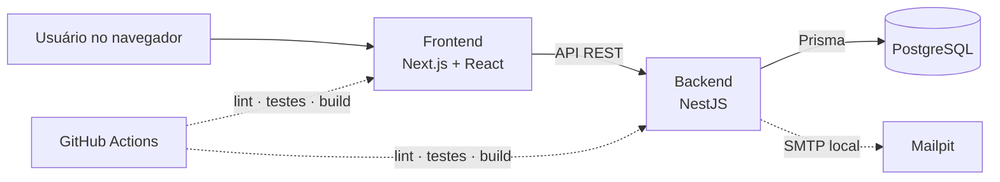

# Marketplace de Automações

[](https://github.com/PedroNilton/marketplace-automacoes/actions/workflows/ci.yml)


Marketplace brasileiro para conectar compradores que desejam automatizar processos a profissionais especializados em automações, integrações e soluções low-code, no-code ou desenvolvidas sob medida.

> [!IMPORTANT]
> O produto está em desenvolvimento e ainda não opera como marketplace público. O repositório registra de forma transparente o que já foi implementado, o que está planejado e as decisões que orientam cada incremento.

## Visão rápida

| | Estado atual |
|---|---|
| **Marco** | M1 — Fundação executável |
| **Incremento** | Spec 001 — Identidade e acesso |
| **Concluído** | Tarefas T-001-001 a T-001-019 |
| **Próximo passo** | T-001-020 — Reenvio de verificação |
| **Qualidade** | Formatação, lint, testes e builds verificados pelo GitHub Actions |

## Proposta do MVP

Validar, em uma beta controlada, a menor jornada completa entre os dois lados do marketplace:

```text
vendedor cria perfil e oferta
    → administrador aprova
    → comprador encontra e solicita
    → vendedor aceita e entrega
    → comprador aprova e avalia
```

A beta não processará pagamentos. Os preços serão apenas informativos até existir uma especificação financeira própria.

## O que já está implementado

- Workspace com frontend Next.js e backend NestJS
- Configuração tipada e validada por ambiente
- PostgreSQL e Mailpit executados localmente com Docker Compose
- Schema de identidade e migrations versionadas com Prisma
- Políticas de e-mail e senha, incluindo hash Argon2id
- Tokens seguros, sessões e limitação de tentativas
- Casos de uso transacionais de cadastro e confirmação de e-mail
- Testes unitários, de integração e E2E
- Pipeline de CI para validar cada pull request e a branch `main`

## O que ainda não está disponível

- Jornada utilizável de cadastro, confirmação e login pela interface
- Endpoints públicos completos de identidade
- Perfis profissionais e publicação de ofertas
- Catálogo, pedidos, mensagens, entrega e avaliações
- Pagamentos ou processamento financeiro
- Ambiente público de demonstração

## Arquitetura

O MVP segue um **monólito modular**, com interface e API separadas no mesmo repositório. Somente o backend executa regras de negócio e acessa o banco.



### Stack

| Área | Tecnologias |
|---|---|
| Frontend | Next.js, React, TypeScript e Tailwind CSS |
| Backend | NestJS, TypeScript e API REST |
| Dados | PostgreSQL e Prisma |
| Segurança | Argon2id, tokens CSPRNG, sessões persistidas e rate limiting |
| Infraestrutura local | Docker Compose e Mailpit |
| Qualidade | Jest, ESLint, Prettier e GitHub Actions |
| Processo | Spec-Driven Development, ADRs e documentação rastreável |

## Como executar localmente

### Pré-requisitos

- Node.js 22 ou superior
- npm 10 ou superior
- Docker Desktop com Docker Compose

### 1. Instale as dependências

```bash
git clone https://github.com/PedroNilton/marketplace-automacoes.git
cd marketplace-automacoes
npm ci
```

### 2. Prepare o ambiente

Copie `.env.example` para `.env` e substitua `AUTH_HMAC_SECRET` por um segredo local com pelo menos 32 caracteres.

```bash
node -e "console.log(require('node:crypto').randomBytes(32).toString('hex'))"
```

As variáveis e regras de validação estão detalhadas em [`docs/development/ENVIRONMENT-CONFIGURATION.md`](docs/development/ENVIRONMENT-CONFIGURATION.md).

### 3. Inicie a infraestrutura e aplique as migrations

```bash
npm run infra:up
npm run prisma:migrate:deploy
```

### 4. Inicie as aplicações

Em terminais separados:

```bash
npm run dev:backend
```

```bash
npm run dev:frontend
```

- Frontend: `http://localhost:3000`
- API: `http://localhost:3001`
- Health check: `http://localhost:3001/health`
- Mailpit: `http://localhost:8025`

## Verificação de qualidade

Execute toda a verificação local com:

```bash
npm run quality
```

O comando valida, nesta ordem:

1. formatação;
2. schema e cliente Prisma;
3. lint do frontend e backend;
4. testes unitários;
5. testes de integração com PostgreSQL;
6. testes E2E;
7. builds de produção.

Consulte também [`docs/development/QUALITY-COMMANDS.md`](docs/development/QUALITY-COMMANDS.md).

## Organização do repositório

```text
marketplace-automacoes/
├── backend/              # API, domínio, aplicação e infraestrutura
├── frontend/             # Aplicação web
├── docs/                 # Produto, domínio, UX e decisões arquiteturais
├── specs/                # Especificações, planos e tarefas por capacidade
├── .github/workflows/    # Verificações automatizadas
├── compose.yaml          # PostgreSQL e Mailpit locais
└── README.md
```

## Documentação

<details>
<summary><strong>Produto e domínio</strong></summary>

- [`docs/product/PRODUCT-DEFINITION.md`](docs/product/PRODUCT-DEFINITION.md) — visão e proposta de valor
- [`docs/product/MVP-SCOPE.md`](docs/product/MVP-SCOPE.md) — capacidades incluídas e excluídas
- [`docs/product/PERSONAS.md`](docs/product/PERSONAS.md) — personas provisórias
- [`docs/product/USER-JOURNEYS.md`](docs/product/USER-JOURNEYS.md) — jornadas detalhadas
- [`docs/product/REQUIREMENTS-CATALOG.md`](docs/product/REQUIREMENTS-CATALOG.md) — requisitos rastreáveis
- [`docs/domain/GLOSSARY.md`](docs/domain/GLOSSARY.md) — vocabulário do domínio
- [`docs/domain/DOMAIN-MODEL.md`](docs/domain/DOMAIN-MODEL.md) — conceitos, relações e estados
- [`docs/domain/BUSINESS-RULES.md`](docs/domain/BUSINESS-RULES.md) — regras numeradas

</details>

<details>
<summary><strong>Arquitetura e desenvolvimento</strong></summary>

- [`docs/architecture/ADR-001-stack-inicial.md`](docs/architecture/ADR-001-stack-inicial.md) — stack e arquitetura inicial
- [`docs/architecture/ADR-002-autenticacao-e-sessoes.md`](docs/architecture/ADR-002-autenticacao-e-sessoes.md) — autenticação e sessões
- [`docs/development/LOCAL-INFRASTRUCTURE.md`](docs/development/LOCAL-INFRASTRUCTURE.md) — PostgreSQL e Mailpit locais
- [`docs/development/PRISMA.md`](docs/development/PRISMA.md) — integração com Prisma
- [`docs/development/DATABASE-MIGRATIONS.md`](docs/development/DATABASE-MIGRATIONS.md) — evolução do banco
- [`docs/ux/SCREEN-MAP.md`](docs/ux/SCREEN-MAP.md) — mapa funcional de telas

</details>

<details>
<summary><strong>Processo e planejamento</strong></summary>

- [`docs/CONSTITUTION.md`](docs/CONSTITUTION.md) — princípios obrigatórios do projeto
- [`docs/SDD-ROADMAP.md`](docs/SDD-ROADMAP.md) — roteiro até a beta
- [`specs/README.md`](specs/README.md) — processo das especificações
- [`specs/001-identidade-acesso/`](specs/001-identidade-acesso/) — especificação em implementação
- [`docs/README.md`](docs/README.md) — índice completo da documentação

</details>

## Princípio de contribuição

Uma funcionalidade só avança para código quando possui:

1. especificação aprovada;
2. questões comportamentais resolvidas;
3. plano técnico aprovado;
4. tarefas rastreáveis;
5. critérios de aceite e estratégia de testes.

Mudanças devem preservar o escopo da beta e manter documentação, contratos, migrations, código e testes sincronizados.

## Próximo passo

Implementar o reenvio de verificação pela tarefa `T-001-020`, mantendo resposta neutra, intervalo e limites de emissão.
