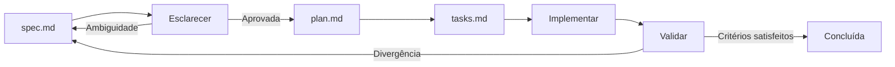

# Roteiro SDD — Marketplace de Automações

- **Versão:** 1.11.0
- **Status:** Ativo
- **Data:** 15 de agosto de 2026
- **Método:** Spec-Driven Development

## 1. Objetivo

Este roteiro organiza a passagem da visão do produto para especificações, planos, tarefas, implementação e validação. Ele impede que o projeto comece pelo código sem requisitos suficientes e mostra o próximo artefato autorizado.

## 2. Estado atual

### Fundação do produto

| Artefato | Estado | Resultado |
|---|---|---|
| Constituição SDD | Concluído | Princípios e governança obrigatórios |
| Definição do produto | Concluído | Problema, público e proposta de valor |
| Escopo do MVP | Concluído | Beta controlada e jornada vertical |
| Personas | Concluído | Compradora, vendedor e administradora |
| Jornadas | Concluído | Fluxos principais, alternativas e evidências |
| Glossário | Concluído | Vocabulário comum |
| Modelo conceitual | Concluído | Contextos, relações, estados e invariantes |
| Regras de negócio | Concluído | Catálogo numerado e rastreável |
| Mapa de telas | Concluído | Inventário funcional e navegação |
| Catálogo de requisitos | Concluído | Requisitos funcionais, não funcionais e exclusões |
| Stack inicial | Concluído | Tecnologias e arquitetura base |

### Próximo marco

A **Spec 001 — Identidade e acesso** está em implementação incremental. As tarefas T-001-001 a T-001-022 concluíram workspace, aplicações mínimas, infraestrutura local, configuração, qualidade, banco, persistência base, valores de e-mail/senha, relógio, tokens seguros, validação de retorno interno, contas, autorizações temporárias, sessões, limites de autenticação, cadastro, confirmação, reenvio controlado, login e resolução da identidade atual.

O próximo incremento executável é `T-001-023` — logout idempotente da sessão atual. A **Spec 002 — Perfis** permanece como a próxima especificação funcional a preparar, sem interromper a sequência autorizada da Spec 001.

## 3. Fluxo obrigatório de cada funcionalidade

### Gate A — Especificação pronta

- Problema, objetivo e atores claros.
- Escopo incluído e excluído.
- Requisitos e regras referenciados.
- Fluxo principal e alternativas.
- Permissões e dados visíveis.
- Critérios de aceite verificáveis.
- Questões capazes de alterar comportamento resolvidas.

### Gate B — Plano pronto

- Módulos afetados e dependências.
- Contratos de API e erros.
- Modelo de dados e migration previstos.
- Estratégia de autenticação e autorização aplicável.
- Riscos e observabilidade.
- Estratégia de testes derivada dos critérios.
- ADR criado para decisão técnica duradoura, quando necessário.

### Gate C — Tarefas prontas

- Tarefas pequenas e ordenadas.
- Cada tarefa aponta para requisito ou critério.
- Banco, backend, frontend, testes e documentação estão cobertos quando aplicável.
- Dependências e validação de cada tarefa estão explícitas.
- Nenhuma tarefa amplia silenciosamente o escopo.

### Gate D — Entrega pronta

- Critérios de aceite satisfeitos.
- Testes previstos passando.
- Contratos, migrations e documentação sincronizados.
- Estados de interface tratados.
- Segurança e acesso negado verificados.
- Nenhum segredo versionado.
- Evidência da validação registrada.

## 4. Sequência das especificações

| Ordem | Pasta | Capacidade | Dependências | Marco |
|---:|---|---|---|---|
| 001 | `specs/001-identidade-acesso/` | Cadastro, verificação, sessão e recuperação | ADR de autenticação no plano | Fundação |
| 002 | `specs/002-perfis/` | Perfil básico e profissional | 001 | Primeira fatia |
| 003 | `specs/003-categorias-ofertas/` | Categoria, rascunho e envio | 001, 002 | Primeira fatia |
| 004 | `specs/004-moderacao-ofertas/` | Aprovação, rejeição e remoção | 001, 003 | Primeira fatia |
| 005 | `specs/005-catalogo-descoberta/` | Catálogo, busca, filtros e detalhes | 003, 004 | Primeira fatia |
| 006 | `specs/006-pedidos/` | Solicitação, aceite, estados e cancelamento | 001, 003, 005 | Jornada comercial sem pagamento |
| 007 | `specs/007-mensagens-entrega/` | Conversa, entrega, revisão e aprovação | 006 | Jornada vertical completa |
| 008 | `specs/008-avaliacoes/` | Nota, comentário e reputação | 006, 007 | Confiança |
| 009 | `specs/009-administracao-basica/` | Contas, suporte, avaliações e auditoria | 001 e módulos moderados | Operação da beta |

As specs podem ser preparadas antes de todas as dependências estarem implementadas, mas a implementação respeitará a ordem necessária.

## 5. Marcos de entrega

### M0 — Fundação documental

**Resultado:** intenção, escopo, domínio, UX e arquitetura inicial documentados.

**Saída:** iniciar Spec 001.

### M1 — Fundação executável

**Inclui:** identidade, banco local, API, frontend base, contratos e testes fundamentais.

**Prova:** usuário cria conta, verifica e-mail em ambiente local controlado, entra e sai com segurança.

### M2 — Primeira fatia vertical

**Inclui:** Specs 002 a 005.

**Prova:** vendedor cria perfil e oferta, administrador aprova, visitante encontra a oferta publicada.

### M3 — Pedido até entrega

**Inclui:** Specs 006 e 007.

**Prova:** comprador solicita, vendedor aceita, participantes conversam, vendedor entrega e comprador conclui.

### M4 — Confiança e operação

**Inclui:** Specs 008 e 009, páginas institucionais e preparação operacional.

**Prova:** comprador avalia; administrador modera oferta, conta e avaliação com rastreabilidade.

### M5 — Beta controlada

**Inclui:** validação de ponta a ponta, revisão jurídica, observabilidade mínima, correções críticas e roteiro de acompanhamento.

**Prova:** execução acompanhada por comprador, vendedor e administrador de teste, sem pagamento interno.

## 6. Decisões técnicas previstas

| Momento | Decisão | Artefato esperado |
|---|---|---|
| Plano da Spec 001 | Sessão, cookie, hash e proteção contra abuso | ADR-002 |
| Plano da Spec 001 | E-mail local e serviço futuro | ADR ou seção do plano |
| Plano da Spec 003 | Imagens opcionais e armazenamento | ADR somente se entrar na fatia |
| Spec 006 | Cancelamento e início de prazo | Regras e critérios da spec |
| Spec 008 | Escala e agregação de nota | Regras e critérios da spec |
| Preparação da beta | Hospedagem e ambientes | ADR de implantação |
| Pós-MVP | Pagamento, comissão e repasse | Especificação financeira + ADR |

## 7. Política de escopo

Uma ideia nova seguirá este caminho:

1. Registrar o problema e a evidência.
2. Verificar se já existe requisito equivalente.
3. Classificar como correção, detalhe compatível ou ampliação.
4. Se ampliar o MVP, atualizar e aprovar o escopo antes da spec.
5. Se for pós-MVP, registrar no backlog sem criar código preparatório.

“Pode ser útil no futuro” não é justificativa suficiente para implementação atual.

## 8. Estratégia de commits documentais

- Um commit por artefato ou decisão coerente.
- Mensagem curta descrevendo o resultado, não a atividade genérica.
- Documento deve estar sem placeholders acidentais e erros de formatação antes do push.
- Mudanças relacionadas devem referenciar IDs estáveis.
- Documentação aprovada vai para `main` conforme decisão atual do projeto.

## 9. Revisões humanas necessárias

Mesmo com preparação autônoma dos artefatos, estes pontos exigem validação do responsável pelo produto antes da beta:

- Política de cancelamento e suporte.
- Diretrizes de conteúdo e denúncia.
- Termos de uso e política de privacidade revisados por profissional competente.
- Serviço de e-mail e hospedagem.
- Critérios, participantes e duração da beta.
- Qualquer integração financeira futura.

## 10. Indicadores de progresso

O progresso será medido por artefatos e comportamentos concluídos, não por quantidade de linhas de código:

- Specs aprovadas.
- Critérios de aceite cobertos.
- Fatias verticais executáveis.
- Riscos críticos testados.
- Jornadas acompanhadas concluídas.
- Hipóteses validadas ou refutadas na beta.

## 11. Próxima ação autorizada

Implementar `T-001-023` na Spec 001: derivar o digest do cookie e revogar a sessão atual de forma idempotente, sem reativar ou revelar estado sensível. A criação de `specs/002-perfis/spec.md` permanece como a próxima frente documental quando for retomada.
