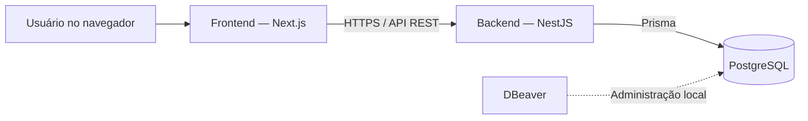

# ADR-001 — Stack inicial do Marketplace de Automações

- **Status:** Aceito
- **Data:** 31 de julho de 2026
- **Escopo:** Fundação técnica do MVP

## Contexto

O projeto será um marketplace no qual vendedores poderão anunciar automações e compradores poderão encontrar e contratar essas soluções.

Como o desenvolvimento começará por especificações, antes do código, a stack inicial precisa ser simples, conhecida, independente de serviços BaaS e capaz de evoluir sem exigir microserviços no MVP.

## Decisão

A aplicação será construída com frontend e backend separados no mesmo repositório. O backend será a única camada autorizada a executar regras de negócio e acessar o banco de dados.

| Área | Tecnologia | Responsabilidade |
|---|---|---|
| Linguagem | TypeScript | Linguagem comum no frontend e backend |
| Frontend | Next.js com React | Páginas, componentes e experiência do usuário |
| Estilização | Tailwind CSS | Interface responsiva e padronizada |
| Backend | NestJS | API, autenticação, autorização e regras de negócio |
| Comunicação | API REST | Contrato entre frontend e backend |
| Banco de dados | PostgreSQL | Persistência dos dados da plataforma |
| ORM e migrations | Prisma | Consultas tipadas e evolução versionada do banco |
| Administração do banco | DBeaver | Inspeção de tabelas, dados e consultas SQL |
| Documentação da API | OpenAPI/Swagger | Contrato navegável dos endpoints |
| Especificações | Markdown e Mermaid | Requisitos, fluxos e diagramas versionados |
| Versionamento | Git e GitHub | Histórico, colaboração e rastreabilidade |

## Arquitetura inicial



O sistema será um **monólito modular**: haverá apenas uma aplicação de backend, dividida internamente por áreas de negócio, como identidade, perfis, ofertas, pedidos, avaliações e administração.

## Responsabilidades

### Frontend

- Exibir páginas e componentes.
- Capturar e validar dados básicos de formulários.
- Consumir a API REST.
- Tratar carregamento, ausência de dados e erros.
- Não acessar o PostgreSQL diretamente.
- Não conter segredos ou regras críticas de negócio.

### Backend

- Autenticar usuários e controlar sessões.
- Autorizar ações de comprador, vendedor e administrador.
- Validar todas as entradas recebidas.
- Executar as regras de negócio.
- Ler e gravar dados por meio do Prisma.
- Expor endpoints REST documentados.

### Banco de dados

- Usar PostgreSQL padrão, sem dependência de Supabase, Firebase ou outro BaaS.
- Manter alterações estruturais em migrations versionadas pelo Prisma.
- Usar o DBeaver para consulta e diagnóstico.
- Evitar alterações manuais de estrutura pelo DBeaver, pois elas poderiam divergir das migrations do projeto.

## Autenticação

A autenticação será responsabilidade do backend. A primeira especificação de identidade deverá definir:

- Cadastro com e-mail e senha.
- Armazenamento seguro de senhas por hash.
- Verificação de e-mail.
- Recuperação de senha.
- Sessões ou tokens transportados em cookies seguros.
- Permissões de comprador, vendedor e administrador.

A escolha detalhada entre sessões e tokens será registrada em um ADR específico antes da implementação.

## Estrutura planejada do repositório

```text
marketplace-automacoes/
├── frontend/       # Aplicação Next.js
├── backend/        # API NestJS
├── docs/           # Produto, domínio, UX e arquitetura
├── specs/          # Especificações SDD por funcionalidade
└── README.md
```

Esta estrutura registra a direção do projeto. As pastas de código só serão criadas depois que as especificações fundamentais forem aprovadas.

## Itens essenciais para o primeiro fluxo

- Frontend Next.js.
- Backend NestJS.
- API REST.
- PostgreSQL.
- Prisma e migrations.
- Autenticação básica.
- Validação de entradas.
- Testes do fluxo principal.
- Documentação da API.

## Decisões adiadas

Os itens abaixo não fazem parte da fundação inicial e terão especificações próprias quando forem necessários:

- Provedor de hospedagem.
- Armazenamento de imagens e arquivos.
- Pagamentos e repasses.
- E-mails transacionais.
- Chat em tempo real.
- Cache e filas.
- Busca especializada.
- Monitoramento avançado.
- Aplicativo móvel.
- Microserviços.

## Consequências

### Benefícios

- Separação clara entre interface, regras e dados.
- Uma única linguagem nas aplicações.
- PostgreSQL independente e portável.
- Banco e API com evolução versionada.
- Arquitetura suficiente para o MVP e preparada para crescimento gradual.

### Custos aceitos

- Frontend e backend serão executados como duas aplicações.
- A autenticação exigirá uma especificação cuidadosa de segurança.
- O contrato REST precisará permanecer sincronizado entre frontend e backend.

## Regra de implementação

Nenhum módulo será implementado antes de possuir, no mínimo:

1. Objetivo e atores.
2. Escopo incluído e excluído.
3. Regras de negócio.
4. Fluxo principal e exceções.
5. Critérios de aceite verificáveis.
6. Modelo de dados afetado.
7. Plano técnico.
8. Lista de tarefas e testes.

O próximo documento do projeto será a Constituição SDD, que definirá os princípios obrigatórios para todas as especificações e implementações.
