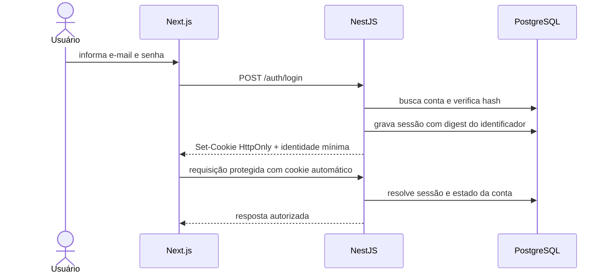

# ADR-002 — Autenticação e Sessões Web

- **Status:** Aceito
- **Data:** 31 de julho de 2026
- **Escopo:** Spec 001 — Identidade e acesso
- **Substitui:** Nenhuma decisão anterior

## Contexto

O MVP terá frontend Next.js, API NestJS e PostgreSQL. A mesma aplicação web precisa autenticar compradores, vendedores e administradores, encerrar sessões imediatamente e invalidá-las após redefinição de senha ou suspensão de conta.

O projeto não precisa oferecer API pública, aplicativo móvel ou autenticação entre microserviços. Tokens acessíveis ao JavaScript aumentariam a exposição em caso de XSS, e JWTs de longa duração dificultariam revogação imediata sem infraestrutura adicional.

A solução deve permanecer simples, independente de BaaS e compatível com a beta controlada.

## Decisão

Será usada **sessão opaca mantida pelo backend**, com identificador aleatório enviado ao navegador em cookie `HttpOnly` e registro correspondente no PostgreSQL.

O identificador não conterá dados do usuário. A API resolverá a sessão, consultará o estado atual da conta e executará autorização em cada operação protegida.

## Identificador da sessão

- Será gerado com fonte criptograficamente segura e pelo menos 256 bits de aleatoriedade.
- O valor bruto existirá apenas no navegador e no instante de emissão.
- O PostgreSQL armazenará somente um digest seguro do identificador.
- Comparações relevantes evitarão exposição por logs ou mensagens.
- Um novo login produzirá uma nova sessão; o identificador não será reutilizado.

## Cookie de sessão

Em ambiente HTTPS:

- Nome com prefixo `__Host-`, definido pelo plano de configuração.
- `Secure` habilitado.
- `HttpOnly` habilitado.
- `SameSite=Lax` como base do fluxo web.
- `Path=/`.
- Sem atributo `Domain`.
- Sem conteúdo além do identificador opaco.

O ambiente local poderá usar nome e configuração exclusivos de desenvolvimento quando HTTP em `localhost` impedir o cookie seguro. Essa exceção não poderá ser herdada pela produção.

O identificador de sessão não será armazenado em `localStorage`, `sessionStorage`, corpo persistido da página ou estado serializado acessível ao JavaScript.

## Duração e revogação

Valores iniciais, configuráveis por ambiente:

- Expiração absoluta: 7 dias.
- Expiração por inatividade: 24 horas.
- Atualização da atividade com frequência limitada para evitar escrita em toda requisição.

A sessão será considerada inválida quando:

- Não existir ou o digest não corresponder.
- Tiver expirado por tempo absoluto ou inatividade.
- Tiver sido revogada.
- A conta não existir ou estiver suspensa ou desativada.
- A política futura exigir reautenticação para a operação.

Logout revoga a sessão atual. Redefinição de senha revoga todas as sessões da conta. Suspensão passa a bloquear sessões existentes mesmo antes de uma limpeza assíncrona.

## Proteção contra CSRF

Cookies são enviados automaticamente pelo navegador, portanto `SameSite` não será a única defesa.

Operações que alteram estado exigirão:

1. Método HTTP não seguro apropriado; `GET`, `HEAD` e `OPTIONS` não alterarão estado.
2. Conteúdo JSON nos endpoints da aplicação, salvo exceção documentada.
3. Token CSRF sincronizado, imprevisível e vinculado à sessão, enviado em cabeçalho customizado.
4. Validação de origem permitida e política CORS explícita.
5. Rejeição de requisições cross-site identificadas por metadados do navegador quando aplicável.

O token CSRF não será colocado em URL nem em log. Endpoints públicos de cadastro, login e recuperação, que ainda não possuem sessão autenticada, usarão validação de origem, tipo de conteúdo e limitação contra abuso.

## Senhas

Será usado **Argon2id** para hashing de senha.

Parâmetros iniciais mínimos:

- Memória: 19 MiB.
- Iterações: 2.
- Paralelismo: 1.
- Salt único gerado pela implementação.

Os parâmetros serão configuráveis e medidos no ambiente de implantação antes da beta. A aplicação poderá aumentá-los sem mudar o contrato do usuário, e hashes antigos poderão ser atualizados após login válido.

Um pepper só será adotado quando existir mecanismo operacional adequado para armazenar, rotacionar e recuperar o segredo. Pepper não será incluído no banco nem no repositório.

## Tokens de e-mail

Verificação de e-mail e redefinição de senha usarão valores aleatórios independentes, com pelo menos 256 bits, codificados de forma segura para URL.

- O valor bruto será enviado uma única vez no link.
- O banco armazenará digest do valor, finalidade, conta, criação, expiração e consumo.
- Token será de uso único.
- Emitir novo token da mesma finalidade invalidará os pendentes anteriores quando a regra do fluxo determinar.
- Token não aparecerá em logs, métricas ou mensagens de erro.

Prazos iniciais:

- Verificação de e-mail: 24 horas.
- Redefinição de senha: 30 minutos.

Esses prazos serão configuráveis, mas qualquer mudança deverá preservar a comunicação apresentada ao usuário.

## Proteção contra abuso

Será aplicada limitação em camadas, sem depender somente do endereço IP:

- Login: sinais por conta normalizada e origem técnica, com atraso progressivo e limite temporário.
- Cadastro: limites por origem e e-mail normalizado.
- Reenvio de verificação: intervalo mínimo e janela por conta/origem.
- Recuperação: resposta neutra e limites por conta/origem.
- Confirmação de token: limite de tentativas e consumo atômico.

Não haverá bloqueio permanente automático baseado apenas em tentativas públicas, pois isso permitiria negação de serviço contra terceiros. Limiares exatos serão configurados e testados no plano.

## Autorização

Autenticação fornecerá uma identidade mínima:

- Identificador do usuário.
- Estado da conta.
- Situação da verificação de e-mail.
- Permissões administrativas quando existentes.

Cada módulo continuará responsável por verificar propriedade, participação e regra de negócio. O frontend poderá ocultar ações, mas não será fonte de autorização.

Uma sessão de conta não verificada permitirá somente:

- Consultar a própria situação mínima.
- Reenviar verificação.
- Confirmar verificação.
- Encerrar sessão.
- Acessar conteúdo público.

## Implantação esperada

- Frontend e API deverão operar em origens explicitamente configuradas e controladas.
- Produção e beta pública usarão HTTPS integral.
- CORS permitirá apenas origens exatas necessárias e credenciais quando aplicável; curinga não será usado com cookies.
- Proxies confiáveis e origem pública serão configurados explicitamente antes da implantação.
- Respostas que criam ou expõem estado de sessão usarão diretivas de cache restritivas.

## Modelo conceitual de persistência

### Sessão

- Identificador interno.
- Usuário.
- Digest do identificador opaco.
- Criada em, atividade em, expira em e expiração absoluta.
- Revogada em e motivo opcional controlado.

### Autorização temporária

- Identificador interno.
- Usuário.
- Finalidade: verificação ou redefinição.
- Digest do token.
- Criada em, expira em e consumida em.

O plano definirá chaves, índices, constraints e migrations.

## Alternativas consideradas

### JWT de acesso e refresh token

**Benefício:** adequado a clientes diversos e serviços distribuídos.

**Rejeitado no MVP:** não há cliente externo ou microserviços; revogação, rotação e invalidação imediata adicionariam complexidade sem necessidade atual. Um JWT autocontido também manteria informações desatualizadas até expirar ou exigir consulta adicional.

### JWT em `localStorage`

**Rejeitado:** torna o token diretamente acessível ao JavaScript e amplia impacto de XSS. Não oferece benefício necessário ao navegador do MVP.

### Sessão inteira em cookie assinado

**Benefício:** elimina consulta de sessão no banco.

**Rejeitado:** dificulta revogação centralizada, invalidação de todas as sessões e atualização imediata do estado da conta.

### `express-session` com armazenamento em memória

**Rejeitado:** o armazenamento padrão em memória não é apropriado para produção e perderia sessões em reinício. Uma abstração de sessão com repositório PostgreSQL mantém controle explícito e testável.

### Serviço de autenticação terceirizado ou BaaS

**Rejeitado nesta fase:** contraria a decisão de backend e PostgreSQL próprios e adiciona dependência externa sem requisito que a justifique.

## Consequências

### Benefícios

- Logout, redefinição e suspensão produzem revogação imediata.
- Cookie `HttpOnly` reduz exposição do identificador ao JavaScript.
- Sessão não carrega dados pessoais ou permissões congeladas.
- Estratégia é simples para uma aplicação web e um monólito modular.
- Auditoria e expiração permanecem sob controle do backend.

### Custos aceitos

- Requisições autenticadas consultam o armazenamento de sessão ou uma abstração equivalente.
- Banco acumula sessões e exige limpeza controlada de registros expirados.
- Proteção CSRF precisa ser implementada e testada.
- Frontend e API precisam coordenar cookies, CORS e cabeçalho CSRF.

### Riscos residuais

- XSS ainda pode executar ações no contexto do usuário, embora não leia cookie `HttpOnly`; CSP, validação e prevenção de XSS continuam necessárias.
- Conta administrativa sem MFA possui risco maior e exige beta restrita, permissão mínima e revisão antes de expansão.
- Limites mal calibrados podem prejudicar usuários ou permitir abuso; observação da beta deverá orientá-los.

## Critérios de revisão desta decisão

Reavaliar este ADR se:

- Surgir aplicativo móvel ou API para terceiros.
- O backend for dividido em serviços independentes.
- A carga de consulta de sessões tornar-se problema demonstrado.
- Requisitos regulatórios ou empresariais exigirem provedor de identidade.
- MFA, passkeys ou login social entrarem no escopo.

Qualquer substituição deverá preservar revogação, proteção do navegador e autorização atualizada.

## Referências

- [NIST SP 800-63B](https://pages.nist.gov/800-63-4/sp800-63b.html)
- [OWASP Session Management Cheat Sheet](https://cheatsheetseries.owasp.org/cheatsheets/Session_Management_Cheat_Sheet.html)
- [OWASP CSRF Prevention Cheat Sheet](https://cheatsheetseries.owasp.org/cheatsheets/Cross-Site_Request_Forgery_Prevention_Cheat_Sheet.html)
- [OWASP Password Storage Cheat Sheet](https://cheatsheetseries.owasp.org/cheatsheets/Password_Storage_Cheat_Sheet.html)
- [NestJS — Sessions](https://docs.nestjs.com/techniques/session)

## Próxima etapa

O plano da Spec 001 traduzirá esta decisão em módulos, contratos, modelo de dados, migrations, limites configuráveis e estratégia de testes. Nenhum código será iniciado antes do plano e das tarefas aprovados.
