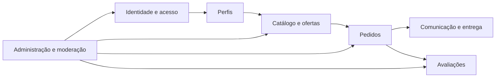
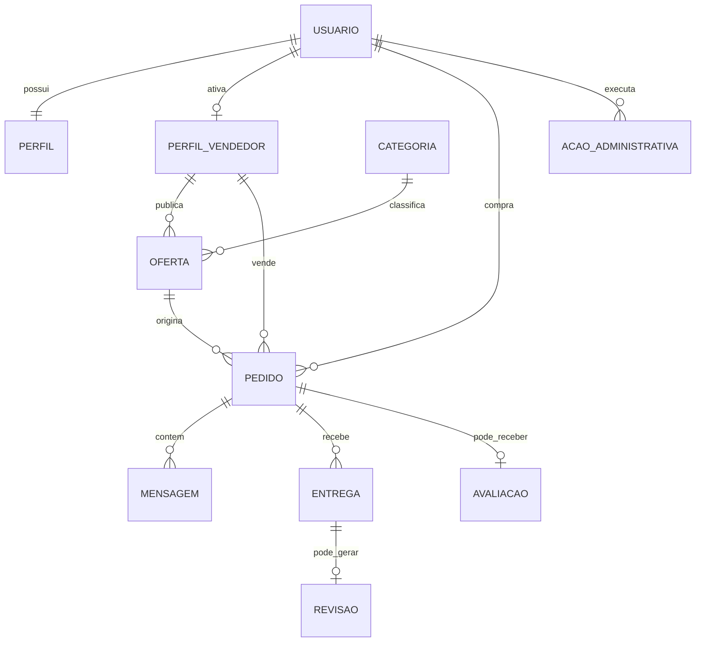
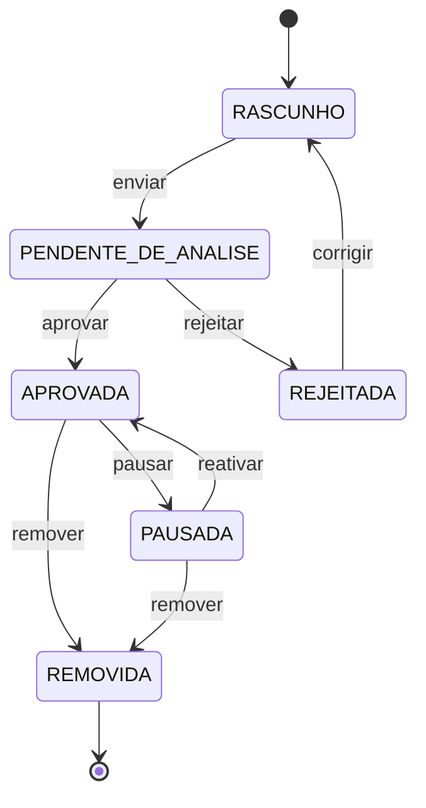
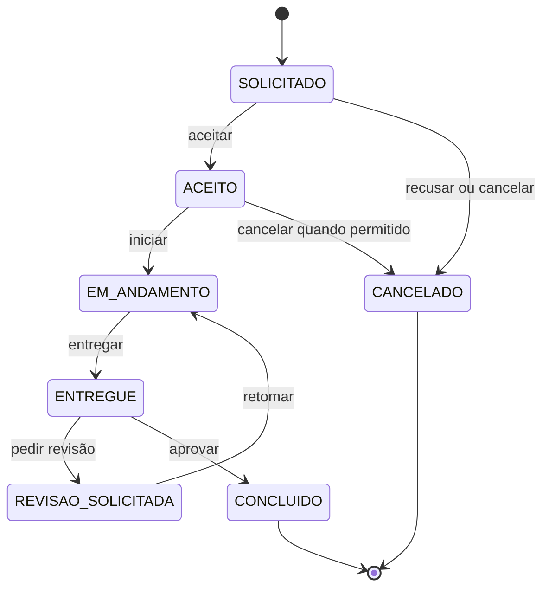

# Modelo Conceitual de Domínio — Marketplace de Automações

- **Versão:** 1.0.0
- **Status:** Aprovado
- **Data:** 31 de julho de 2026
- **Nível:** Conceitual, independente de persistência

## 1. Finalidade

Este documento identifica os conceitos centrais, suas responsabilidades, relações, ciclos de vida e invariantes no MVP. Ele orientará as especificações e o modelo de dados futuro.

Não define tabelas, colunas, endpoints, classes do Prisma ou componentes de interface.

## 2. Visão dos contextos

| Contexto | Responsabilidade principal |
|---|---|
| Identidade e acesso | Contas, credenciais, sessões, estados e permissões |
| Perfis | Apresentação básica e profissional do usuário |
| Catálogo e ofertas | Categorias, ofertas, publicação e descoberta |
| Pedidos | Relação privada, escopo contratado e estados do trabalho |
| Comunicação e entrega | Mensagens, entregas e revisões vinculadas ao pedido |
| Avaliações | Reputação originada em pedidos concluídos |
| Administração e moderação | Decisões operacionais protegidas e rastreáveis |

## 3. Relações principais

O diagrama representa multiplicidades conceituais. Regras de unicidade e retenção serão traduzidas para banco e aplicação nos planos técnicos.

## 4. Agregados conceituais

### 4.1 Conta

**Raiz:** Usuário.

**Responsabilidades:**

- Representar identidade e estado de acesso.
- Associar credenciais e sessões sem expô-las ao domínio público.
- Determinar se ações autenticadas são permitidas.
- Conectar a pessoa a perfil básico, perfil profissional e papéis contextuais.

**Conceitos internos ou associados:**

- Credencial de senha.
- Verificação de e-mail.
- Sessão.
- Estado da conta.

**Invariantes:**

- E-mail normalizado deve ser único entre contas utilizáveis.
- Senha nunca é armazenada em texto puro.
- Conta suspensa não inicia ações protegidas de negócio.
- Permissão administrativa não é inferida pela existência de perfil profissional.
- Dados de autenticação não são retornados em perfis públicos.

### 4.2 Perfil

**Raiz:** Perfil básico, ligado a um usuário.

**Responsabilidades:**

- Apresentar informações gerais permitidas.
- Manter separação entre dados privados da conta e apresentação pública.
- Permitir ativação opcional de perfil profissional.

**Perfil profissional:**

- Pertence ao mesmo usuário; não cria outra conta.
- Reúne descrição, competências, ferramentas e links de portfólio.
- Identifica o vendedor responsável por ofertas.

**Invariantes:**

- Cada usuário possui no máximo um perfil profissional ativo no MVP.
- Perfil profissional deve estar completo antes do envio de uma oferta.
- Informações privadas da conta não se tornam públicas por ativação do perfil profissional.

### 4.3 Oferta

**Raiz:** Oferta.

**Responsabilidades:**

- Estruturar o serviço de automação.
- Manter tipo, categoria, proposta, escopo, requisitos, entregáveis, prazo e preço informativo.
- Controlar edição, moderação e disponibilidade pública.

**Conceitos associados:**

- Categoria principal.
- Vendedor proprietário.
- Decisões de moderação.
- Imagem principal opcional, após definição de armazenamento.

**Invariantes:**

- Toda oferta pertence a exatamente um vendedor.
- Toda oferta enviada à análise possui categoria principal ativa.
- Apenas oferta aprovada e não pausada pode originar nova solicitação.
- Oferta pública exibe somente informações explicitamente públicas.
- Rejeição e remoção administrativas exigem justificativa registrada.
- Mudanças posteriores na oferta não alteram cópias já vinculadas a pedidos.

### 4.4 Pedido

**Raiz:** Pedido.

**Responsabilidades:**

- Relacionar comprador, vendedor e oferta de origem.
- Preservar o entendimento essencial da oferta no momento da solicitação.
- Controlar aceite, execução, entrega, revisão, conclusão e cancelamento.
- Proteger acesso e registrar eventos relevantes.

**Conceitos internos ou associados:**

- Cópia da oferta.
- Requisitos enviados pelo comprador.
- Estado atual.
- Histórico de estados.
- Motivos de recusa ou cancelamento.
- Mensagens, entregas, revisões e avaliação.

**Invariantes:**

- Um pedido possui exatamente um comprador e um vendedor.
- Comprador e vendedor derivam da oferta e da solicitação; não podem ser trocados.
- A oferta de origem deve estar disponível no instante de criação.
- O pedido permanece compreensível mesmo que a oferta seja pausada ou removida depois.
- Somente transições previstas podem mudar o estado.
- Eventos relevantes não são apagados por uma transição posterior.
- Usuário estranho ao pedido não pode consultá-lo.

### 4.5 Conversa e entrega

**Raiz de consistência:** Pedido.

**Responsabilidades:**

- Manter comunicação privada em contexto.
- Registrar versões de entrega e solicitações de revisão.
- Impedir que falhas deixem entrega e estado divergentes.

**Invariantes:**

- Toda mensagem pertence a um pedido e possui autor participante.
- Toda entrega pertence a um pedido e é criada pelo vendedor responsável.
- Mensagem de entrega é obrigatória.
- Nova entrega não substitui nem apaga a anterior.
- Revisão identifica a entrega questionada e possui justificativa.
- Registro da entrega e mudança para `ENTREGUE` ocorrem como uma única operação lógica.

### 4.6 Avaliação

**Raiz:** Avaliação.

**Responsabilidades:**

- Representar a percepção do comprador sobre um pedido concluído.
- Alimentar reputação pública verificável do vendedor.
- Permitir moderação sem perder rastreabilidade administrativa.

**Invariantes:**

- Avaliação só pode ser criada pelo comprador do pedido.
- Pedido deve estar concluído.
- Existe no máximo uma avaliação por pedido no MVP.
- Nota é obrigatória e comentário é opcional.
- Avaliação removida deixa de ser pública, mas a ação administrativa permanece registrada.

### 4.7 Administração

**Raiz:** Ação administrativa.

**Responsabilidades:**

- Registrar decisões de moderação e suporte com contexto suficiente.
- Aplicar suspensão, reativação, aprovação, rejeição e remoção autorizadas.
- Permitir investigação proporcional sem transformar administrador em participante do pedido.

**Invariantes:**

- Toda ação identifica administrador, alvo, tipo e data.
- Ações de impacto exigem justificativa quando definida pelas regras.
- Ação administrativa não apaga o histórico do recurso afetado.
- Permissão é verificada no momento da ação.
- Dados de autenticação e segredos nunca são disponibilizados à administração.

## 5. Ciclo de vida da oferta

### Responsáveis pelas transições

| Transição | Ator permitido |
|---|---|
| Criar e editar rascunho | Vendedor proprietário |
| Enviar para análise | Vendedor proprietário |
| Aprovar ou rejeitar | Administrador autorizado |
| Corrigir oferta rejeitada | Vendedor proprietário |
| Pausar ou reativar | Vendedor proprietário, se conta e oferta permitirem |
| Remover | Administrador autorizado |

Reativação e alteração material de oferta aprovada serão detalhadas na especificação de ofertas.

## 6. Ciclo de vida do pedido

### Observações

- Recusa e cancelamento poderão compartilhar o estado terminal `CANCELADO`, mas deverão preservar motivos e eventos distintos.
- O MVP exige aprovação explícita; conclusão automática por prazo não está aprovada.
- Não há estados financeiros porque a plataforma não processa pagamentos na beta.
- As permissões e condições exatas de cancelamento permanecem para a especificação de pedidos.

## 7. Eventos relevantes do domínio

| Evento | Origem | Consumidores conceituais |
|---|---|---|
| Conta criada | Identidade | Perfil, comunicação futura |
| E-mail verificado | Identidade | Capacidades protegidas |
| Perfil profissional ativado | Perfis | Ofertas |
| Oferta enviada para análise | Ofertas | Administração |
| Oferta aprovada ou rejeitada | Administração | Ofertas, comunicação futura |
| Pedido solicitado | Pedidos | Vendedor, comunicação futura |
| Pedido aceito ou recusado | Pedidos | Comprador |
| Mensagem registrada | Comunicação | Participantes |
| Entrega registrada | Entrega | Pedido, comprador |
| Revisão solicitada | Entrega | Pedido, vendedor |
| Pedido concluído | Pedidos | Avaliações |
| Avaliação publicada | Avaliações | Perfil público |
| Conta suspensa | Administração | Identidade e capacidades protegidas |

No monólito modular, “evento” descreve um fato do negócio; não exige fila, broker ou microserviço no MVP.

## 8. Limites de visibilidade

| Informação | Pública | Participantes | Administrador autorizado |
|---|---:|---:|---:|
| Oferta aprovada disponível | Sim | Sim | Sim |
| Perfil profissional | Sim | Sim | Sim |
| E-mail e dados privados da conta | Não | Próprio titular | Somente quando indispensável e autorizado |
| Requisitos do pedido | Não | Sim | Suporte autorizado |
| Mensagens e entregas | Não | Sim | Suporte autorizado |
| Avaliação publicada | Sim | Sim | Sim |
| Histórico administrativo | Não | Não por padrão | Conforme permissão |
| Senha, hash, token ou segredo | Nunca | Nunca | Nunca |

## 9. Dependências permitidas entre contextos

- Perfis dependem da identidade do usuário, não de suas credenciais.
- Ofertas dependem do identificador e do estado permitido do vendedor.
- Pedidos recebem uma referência e uma cópia da oferta, sem depender da mutabilidade futura do catálogo.
- Comunicação, entrega e avaliação dependem das decisões do pedido.
- Administração solicita operações aos contextos responsáveis; não altera diretamente seus dados internos.
- Identidade não depende de ofertas ou pedidos para autenticar uma conta.

## 10. Decisões deliberadamente abertas

- Estrutura física das tabelas e identificadores.
- Estratégia de sessão e cookies.
- Escala da nota de avaliação.
- Regra detalhada de cancelamento.
- Reanálise após alteração de oferta aprovada.
- Retenção e anonimização após desativação de conta.
- Armazenamento da imagem de perfil e da oferta.
- Serviço e conteúdo de notificações por e-mail.

Cada decisão será resolvida no ADR ou na especificação responsável antes do código correspondente.

## 11. Critérios para evolução

Uma alteração neste modelo exige revisão quando:

- Introduzir novo conceito central ou novo estado.
- Mudar propriedade ou responsabilidade entre contextos.
- Alterar uma invariante.
- Exigir que um contexto acesse detalhes internos de outro.
- Incluir pagamento, arquivo hospedado ou execução de automação na plataforma.

Mudanças persistentes de arquitetura deverão possuir ADR; mudanças de comportamento deverão atualizar a especificação aplicável.
