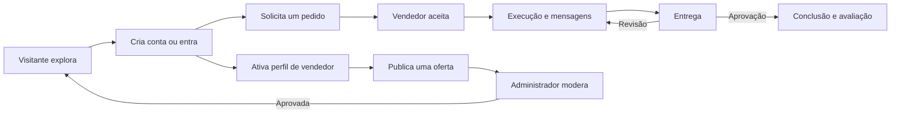

# Jornadas dos Usuários — Marketplace de Automações

- **Versão:** 1.0.0
- **Status:** Aprovado
- **Data:** 31 de julho de 2026
- **Documentos de origem:** `PRODUCT-DEFINITION.md`, `MVP-SCOPE.md` e `PERSONAS.md`

## 1. Finalidade

Este documento descreve como visitantes, compradores, vendedores e administradores percorrem o MVP. As jornadas conectam necessidades humanas às futuras telas e especificações funcionais.

Elas representam o comportamento esperado da beta controlada. Não definem componentes visuais, endpoints ou tabelas.

## 2. Princípios comuns

- Uma única conta pode comprar e vender.
- Ações privadas exigem autenticação.
- O backend valida identidade, permissão e transições de estado.
- O MVP não processa pagamentos; preços são informativos.
- Mensagens, entregas e decisões relevantes permanecem vinculadas ao pedido.
- Dados privados não aparecem em páginas públicas.
- Toda ação importante informa resultado e próximo passo.
- Estados de carregamento, vazio, erro e acesso negado fazem parte de cada fluxo.

## 3. Mapa geral

## 4. J-01 — Visitante encontra uma oferta

- **Persona principal:** Mariana, antes de criar conta.
- **Objetivo:** entender se existe uma solução relevante e confiável.
- **Entrada:** página inicial, categoria, link compartilhado ou busca.
**Saída de sucesso:** oferta relevante visualizada e decisão de entrar ou cadastrar-se para solicitar.

### Fluxo principal

1. O visitante acessa a página inicial.
2. Entende o propósito da plataforma e que a beta não processa pagamentos.
3. Navega por categoria ou informa um termo de busca.
4. Recebe apenas ofertas aprovadas e disponíveis.
5. Aplica filtros básicos por categoria ou tipo.
6. Abre uma oferta.
7. Consulta problema resolvido, descrição, entregáveis, requisitos, prazo, preço informativo e vendedor.
8. Abre o perfil público do vendedor se desejar mais contexto.
9. Seleciona a ação de solicitar a oferta.
10. Se não estiver autenticado, é orientado a entrar ou criar conta e depois retornar à oferta.

### Alternativas e falhas

- Busca sem resultado: explicar a ausência e permitir remover filtros ou tentar outro termo.
- Oferta pausada ou removida: impedir nova solicitação e sugerir retorno ao catálogo.
- Sessão expirada: preservar o destino pretendido após novo login, quando seguro.
- Falha de carregamento: permitir nova tentativa sem perder os filtros informados.

### Pontos de confiança

- Indicar que a oferta foi moderada sem prometer garantia técnica absoluta.
- Separar informações profissionais públicas de dados privados do vendedor.
- Destacar entregáveis, requisitos e limitações antes da solicitação.

### Evidências da beta

- Busca que resulta em visualização de oferta.
- Visualização que inicia autenticação ou solicitação.
- Termos sem resultado.
- Etapa de abandono observada.

## 5. J-02 — Comprador solicita e conclui um pedido

- **Persona principal:** Mariana.
- **Objetivo:** registrar sua necessidade, acompanhar o serviço e aprovar uma entrega compreensível.
- **Pré-condições:** conta ativa, e-mail verificado e oferta aprovada e disponível.
**Saída de sucesso:** pedido concluído e avaliação registrada.

### Fluxo principal

1. A compradora abre uma oferta aprovada.
2. Revisa entregáveis, requisitos, prazo e preço informativo.
3. Inicia a solicitação.
4. Informa os requisitos pedidos pelo vendedor e contexto adicional necessário.
5. Confirma que não haverá pagamento processado pela plataforma durante a beta.
6. Revisa e envia a solicitação.
7. O sistema cria o pedido em `SOLICITADO` e preserva uma cópia dos dados essenciais da oferta.
8. A compradora acompanha a resposta do vendedor.
9. Após a aceitação, consulta o andamento e troca mensagens dentro do pedido.
10. Quando o vendedor registra uma entrega, o pedido passa para `ENTREGUE`.
11. A compradora examina a mensagem e os links de entrega.
12. Aprova a entrega; o pedido passa para `CONCLUIDO`.
13. Registra uma nota e, opcionalmente, um comentário.

### Alternativas e falhas

- Requisitos incompletos: destacar campos pendentes antes do envio.
- Oferta tornou-se indisponível antes da confirmação: bloquear a criação e explicar o motivo.
- Vendedor recusa: encerrar a solicitação com motivo visível ao comprador.
- Comprador pede cancelamento em estado permitido: exigir motivo e registrar histórico.
- Entrega precisa de ajuste: solicitar revisão com justificativa; o pedido retorna ao trabalho e poderá receber nova entrega.
- Link externo parece suspeito: exibir aviso e permitir denúncia; a plataforma não deve afirmar que verificou o conteúdo.
- Acesso por terceiro: negar e não revelar existência ou detalhes além do necessário.

### Pontos de confiança

- Mostrar sempre o estado atual e o próximo passo esperado.
- Não alterar silenciosamente o escopo copiado para o pedido.
- Identificar autor e horário de mensagens, entregas e mudanças de estado.
- Permitir avaliação somente depois da conclusão e somente uma vez.

### Evidências da beta

- Solicitações iniciadas e concluídas.
- Tempo até aceite ou recusa.
- Pedidos que chegam à entrega e à conclusão.
- Revisões solicitadas e seus motivos.
- Cancelamentos e pontos de abandono.

## 6. J-03 — Vendedor publica uma oferta

- **Persona principal:** Rafael.
- **Objetivo:** transformar um serviço em oferta clara, moderável e encontrável.
- **Pré-condições:** conta ativa e e-mail verificado.
**Saída de sucesso:** oferta aprovada e publicada no catálogo.

### Fluxo principal

1. O usuário ativa o perfil profissional.
2. Informa descrição, competências, ferramentas e links de portfólio.
3. Inicia uma nova oferta em `RASCUNHO`.
4. Informa título, tipo, categoria, descrição, preço informativo e prazo.
5. Define explicitamente requisitos do comprador, entregáveis e limitações.
6. Salva e revisa o rascunho.
7. Envia para análise; a oferta passa para `PENDENTE_DE_ANALISE` e deixa de ser editável.
8. O administrador analisa o conteúdo.
9. Se aprovada, a oferta passa para `APROVADA` e torna-se pública.
10. O vendedor pode pausá-la sem apagar seu histórico.

### Alternativas e falhas

- Perfil profissional incompleto: orientar a conclusão antes do envio da oferta.
- Campos inválidos: preservar o rascunho e explicar cada correção.
- Rejeição: mostrar o motivo; devolver a oferta para correção sem apagar versões ou decisão administrativa.
- Conta suspensa: bloquear criação, envio e publicação.
- Oferta aprovada precisa de alteração material: retirar da publicação e exigir nova análise quando a regra detalhada determinar.
- Remoção administrativa: impedir publicação e apresentar motivo permitido ao vendedor.

### Pontos de confiança

- Explicar o que é público antes da publicação.
- Proibir pedido de senha, token ou credencial em campos públicos.
- Exigir motivo compreensível em rejeição ou remoção.
- Manter histórico das decisões de moderação.

### Evidências da beta

- Perfil profissional concluído.
- Rascunhos iniciados e enviados.
- Taxa de aprovação e motivos de rejeição.
- Tempo de criação e análise.
- Ofertas pausadas ou abandonadas.

## 7. J-04 — Vendedor conduz e entrega um pedido

- **Persona principal:** Rafael.
- **Objetivo:** confirmar o escopo, executar o trabalho e registrar uma entrega rastreável.
- **Pré-condições:** pedido `SOLICITADO`, vendedor responsável e conta ativa.
**Saída de sucesso:** entrega aprovada e pedido concluído.

### Fluxo principal

1. O vendedor recebe e abre uma solicitação.
2. Consulta a cópia da oferta e os requisitos enviados.
3. Aceita a solicitação; o sistema registra a decisão.
4. Inicia o trabalho e o pedido passa para `EM_ANDAMENTO` conforme regra detalhada.
5. Usa mensagens para esclarecer informações sem substituir o escopo registrado.
6. Executa a automação fora da plataforma.
7. Registra mensagem de entrega e, opcionalmente, links externos.
8. O pedido passa para `ENTREGUE` e aguarda o comprador.
9. Se houver revisão, consulta a justificativa, realiza ajustes e envia nova entrega.
10. Após aprovação, consulta a conclusão e a eventual avaliação.

### Alternativas e falhas

- Requisitos insuficientes: pedir esclarecimentos antes de iniciar, sem exigir credenciais em mensagem pública.
- Solicitação incompatível com a oferta: recusar com motivo antes do início.
- Cancelamento permitido: registrar autor, motivo e estado anterior.
- Falha ao registrar entrega: não mudar o estado até que mensagem e links válidos sejam persistidos juntos.
- Solicitação de revisão abusiva: manter o histórico e permitir suporte administrativo, sem alterar automaticamente a entrega.

### Pontos de confiança

- Somente o vendedor responsável pode aceitar, recusar ou entregar.
- Mensagens e links do pedido são privados aos participantes e acesso administrativo autorizado.
- Cada entrega permanece identificável; nova entrega não apaga a anterior.

### Evidências da beta

- Solicitações aceitas e recusadas.
- Tempo até primeira resposta e entrega.
- Quantidade de ciclos de revisão.
- Pedidos concluídos e cancelados.

## 8. J-05 — Administrador modera uma oferta

- **Persona principal:** Camila.
- **Objetivo:** decidir de modo consistente se uma oferta pode ser publicada.
- **Pré-condições:** conta administrativa ativa e oferta `PENDENTE_DE_ANALISE`.
**Saída de sucesso:** decisão registrada com autor, data e justificativa quando necessária.

### Fluxo principal

1. A administradora acessa a área protegida.
2. Consulta a fila de ofertas pendentes.
3. Abre a oferta e o contexto profissional público do vendedor.
4. Verifica clareza, categoria, entregáveis, requisitos e compatibilidade com as diretrizes.
5. Aprova a oferta ou rejeita com motivo acionável.
6. O sistema registra a ação administrativa.
7. O vendedor visualiza o resultado.

### Alternativas e falhas

- Conteúdo possivelmente ilegal ou abusivo: rejeitar e encaminhar para análise operacional conforme política futura.
- Informação insuficiente: rejeitar para ajuste, sem editar a oferta em nome do vendedor.
- Oferta publicada denunciada: consultar o histórico e remover com justificativa se necessário.
- Ação em conta ou oferta errada: confirmação explícita deve mostrar alvo e impacto antes de executar.
- Administrador sem permissão válida: negar a ação e registrar tentativa relevante.

### Pontos de confiança

- A administração não altera silenciosamente o conteúdo do vendedor.
- Rejeição, remoção e suspensão exigem motivo.
- O acesso a pedidos para suporte é limitado, justificado e rastreável.

### Evidências da beta

- Tempo de análise.
- Motivos recorrentes de rejeição.
- Ofertas removidas após publicação.
- Ações administrativas revertidas.

## 9. J-06 — Administrador atua sobre conta ou avaliação

- **Persona principal:** Camila.
- **Objetivo:** proteger a beta com intervenção proporcional e rastreável.
- **Entrada:** denúncia, solicitação de suporte ou observação operacional.
**Saída de sucesso:** decisão aplicada ao alvo correto e registrada.

### Fluxo principal

1. A administradora localiza o usuário, pedido ou avaliação a partir de informação autorizada.
2. Consulta somente o contexto necessário.
3. Seleciona a ação compatível com sua permissão.
4. Revisa alvo, impacto e justificativa.
5. Confirma suspensão, reativação ou remoção de avaliação.
6. O sistema executa a ação de forma atômica e grava o evento administrativo.
7. A pessoa afetada recebe explicação quando a política permitir.

### Restrições

- Administradores não visualizam senhas, tokens ou segredos.
- Uma suspensão não apaga histórico de pedidos e decisões.
- Uma avaliação removida deixa registro administrativo, embora não permaneça pública.
- Acesso administrativo não concede participação em mensagens ou pedidos.

## 10. Matriz jornada × capacidade

| Capacidade | J-01 | J-02 | J-03 | J-04 | J-05 | J-06 |
|---|---:|---:|---:|---:|---:|---:|
| Identidade e acesso | Apoio | Sim | Sim | Sim | Sim | Sim |
| Perfis | Consulta | Consulta | Sim | Consulta | Consulta | Consulta |
| Categorias e ofertas | Sim | Sim | Sim | Consulta | Sim | Apoio |
| Catálogo e descoberta | Sim | Sim | Não | Não | Não | Não |
| Pedidos | Não | Sim | Não | Sim | Consulta | Consulta |
| Mensagens e entrega | Não | Sim | Não | Sim | Consulta restrita | Consulta restrita |
| Avaliações | Consulta | Sim | Consulta | Consulta | Não | Sim |
| Administração | Não | Não | Não | Não | Sim | Sim |

## 11. Critérios gerais de experiência

Em toda jornada, a pessoa deverá conseguir responder:

1. Onde estou?
2. Qual é o estado atual?
3. O que preciso fazer agora?
4. O que acontecerá depois da ação?
5. Como corrijo um erro ou retorno com segurança?

## 12. Próxima etapa

Estas jornadas alimentam o glossário, o modelo de domínio, as regras de negócio e o mapa de telas. Detalhes ainda abertos serão resolvidos nas especificações funcionais, sem ampliar o MVP silenciosamente.
