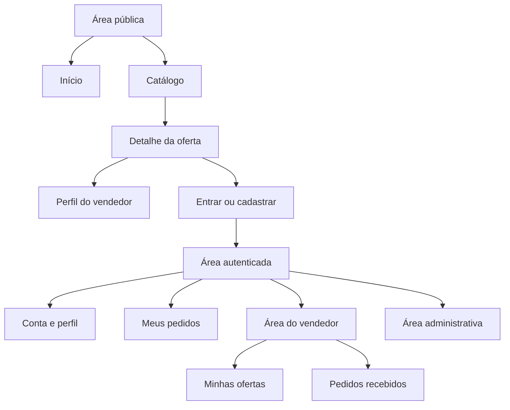

# Mapa de Telas do MVP — Marketplace de Automações

- **Versão:** 1.0.0
- **Status:** Aprovado como inventário funcional
- **Data:** 31 de julho de 2026
- **Documentos de origem:** Escopo, personas, jornadas e regras de negócio

## 1. Finalidade

Este documento identifica as telas necessárias para executar o MVP de ponta a ponta, seus públicos, conteúdos, ações e estados. Ele orientará os fluxos, wireframes e especificações.

Os caminhos sugeridos são referências de navegação e poderão ser ajustados no plano do frontend. Este documento não define identidade visual nem componentes finais.

## 2. Arquitetura de navegação

## 3. Estrutura global

### Navegação pública

- Marca ou nome de trabalho com retorno ao início.
- Acesso ao catálogo e às categorias.
- Busca.
- Como funciona.
- Entrar e criar conta.
- Aviso coerente de beta sem pagamento quando aplicável.

### Navegação autenticada

- Itens públicos.
- Meus pedidos como comprador.
- Área do vendedor quando ativada.
- Perfil e configurações da conta.
- Sair.
- Administração somente para usuário autorizado.

### Rodapé público

- Como funciona.
- Diretrizes de ofertas.
- Termos de uso.
- Política de privacidade.
- Contato e denúncia.

## 4. Telas públicas — `PUB`

| ID | Tela | Caminho sugerido | Objetivo |
|---|---|---|---|
| PUB-01 | Página inicial | `/` | Explicar valor e levar à descoberta de ofertas |
| PUB-02 | Catálogo | `/ofertas` | Listar, buscar, filtrar e ordenar ofertas disponíveis |
| PUB-03 | Categoria | `/categorias/:slug` | Mostrar ofertas de uma categoria |
| PUB-04 | Detalhe da oferta | `/ofertas/:slug-ou-id` | Permitir avaliação informada antes da solicitação |
| PUB-05 | Perfil do vendedor | `/vendedores/:id` | Exibir apresentação profissional, ofertas e avaliações |
| PUB-06 | Como funciona | `/como-funciona` | Explicar fluxos de comprador e vendedor |
| PUB-07 | Diretrizes | `/diretrizes` | Explicar conteúdo permitido e proibido |
| PUB-08 | Termos de uso | `/termos` | Disponibilizar termos adequados à beta |
| PUB-09 | Política de privacidade | `/privacidade` | Explicar tratamento de dados |
| PUB-10 | Contato e denúncia | `/contato` | Oferecer canal operacional mínimo |

### PUB-01 — Página inicial

**Conteúdo essencial:** proposta de valor, busca, categorias iniciais, ofertas recentes aprovadas, resumo de funcionamento e aviso da beta.

**Ações:** buscar, abrir categoria, abrir oferta, entrar, criar conta e conhecer o fluxo.

**Estados:** carregamento parcial das ofertas, catálogo vazio, falha recuperável e conteúdo institucional sempre disponível.

### PUB-02/PUB-03 — Catálogo e categoria

**Conteúdo essencial:** termo pesquisado, filtros ativos, total ou indicação de resultado, cartões de oferta e ordenação recente.

**Ações:** pesquisar, filtrar por categoria e tipo, limpar filtros e abrir oferta.

**Estados:** inicial, carregando, com resultados, sem resultados, erro, oferta removida entre listagem e abertura.

### PUB-04 — Detalhe da oferta

**Conteúdo essencial:** título, tipo, categoria, descrição orientada ao problema, escopo, entregáveis, requisitos, limitações, prazo, preço informativo, vendedor e avaliações válidas.

**Ações:** solicitar, abrir perfil do vendedor, voltar ao catálogo e denunciar pelo canal disponível.

**Estados:** disponível, pausada, removida ou inexistente, carregamento, erro e visitante versus usuário autenticado.

### PUB-05 — Perfil do vendedor

**Conteúdo essencial:** nome de exibição, apresentação, competências, ferramentas, portfólio externo, ofertas disponíveis e avaliações públicas.

**Ações:** abrir oferta e acessar link externo com tratamento seguro.

**Estados:** sem ofertas, sem avaliações, conta indisponível e erro.

## 5. Identidade e recuperação — `AUT`

| ID | Tela | Caminho sugerido | Objetivo |
|---|---|---|---|
| AUT-01 | Criar conta | `/cadastro` | Registrar nome, e-mail e senha |
| AUT-02 | Entrar | `/entrar` | Iniciar sessão |
| AUT-03 | Verificar e-mail | `/verificar-email` | Orientar e confirmar verificação |
| AUT-04 | Esqueci a senha | `/recuperar-senha` | Solicitar recuperação sem expor contas |
| AUT-05 | Definir nova senha | `/redefinir-senha` | Trocar senha com autorização temporária válida |
| AUT-06 | Acesso impedido | `/acesso-indisponivel` | Explicar sessão inválida, conta suspensa ou ação negada |

### Estados obrigatórios

- Formulário inicial e envio em andamento.
- Erros por campo e erro geral recuperável.
- Confirmação neutra no pedido de recuperação.
- Token ausente, inválido ou expirado.
- E-mail ainda não verificado.
- Conta suspensa sem revelar detalhes indevidos.
- Redirecionamento seguro ao destino pretendido após autenticação.

## 6. Conta e perfis — `PER`

| ID | Tela | Caminho sugerido | Objetivo |
|---|---|---|---|
| PER-01 | Minha conta | `/conta` | Consultar dados e ações da conta |
| PER-02 | Editar perfil básico | `/conta/perfil` | Atualizar apresentação geral permitida |
| PER-03 | Ativar perfil profissional | `/vender/ativar` | Iniciar atuação como vendedor |
| PER-04 | Editar perfil profissional | `/vender/perfil` | Manter descrição, competências e portfólio |
| PER-05 | Visualizar meu perfil público | `/vendedores/:id` | Conferir a apresentação pública |

**Estados especiais:** perfil incompleto, link de portfólio inválido, imagem ausente, conta suspensa, alteração salva e falha sem perda dos dados digitados.

## 7. Área do vendedor e ofertas — `OFE`

| ID | Tela | Caminho sugerido | Objetivo |
|---|---|---|---|
| OFE-01 | Visão do vendedor | `/vender` | Resumir ofertas e pedidos que exigem atenção |
| OFE-02 | Minhas ofertas | `/vender/ofertas` | Listar ofertas por estado |
| OFE-03 | Nova oferta | `/vender/ofertas/nova` | Criar rascunho estruturado |
| OFE-04 | Editar oferta | `/vender/ofertas/:id/editar` | Completar ou corrigir rascunho |
| OFE-05 | Revisar e enviar | `/vender/ofertas/:id/revisar` | Confirmar conteúdo antes da moderação |
| OFE-06 | Detalhe gerencial | `/vender/ofertas/:id` | Consultar estado, decisão e ações disponíveis |
| OFE-07 | Resultado da moderação | Integrado a `OFE-06` | Mostrar aprovação ou rejeição e motivo |

### Campos funcionais da oferta

- Título.
- Tipo: pronta ou personalizada.
- Categoria principal.
- Descrição e problema resolvido.
- Escopo incluído e excluído.
- Requisitos do comprador.
- Entregáveis.
- Limitações.
- Prazo estimado.
- Preço informativo em reais.
- Imagem opcional somente após decisão de armazenamento.

### Estados obrigatórios

- Nenhuma oferta.
- Rascunho incompleto ou válido.
- Salvamento em andamento, salvo e falhou.
- Pendente sem edição.
- Rejeitada com motivo e ação de corrigir.
- Aprovada com ação de visualizar ou pausar.
- Pausada com ação de reativar quando permitido.
- Removida com explicação disponível.

## 8. Pedidos do comprador — `COM`

| ID | Tela | Caminho sugerido | Objetivo |
|---|---|---|---|
| COM-01 | Solicitar oferta | `/ofertas/:id/solicitar` | Coletar requisitos e confirmar solicitação |
| COM-02 | Revisar solicitação | Integrado a `COM-01` | Evitar envio acidental ou incompleto |
| COM-03 | Meus pedidos | `/pedidos` | Listar pedidos como comprador por estado |
| COM-04 | Detalhe do pedido | `/pedidos/:id` | Acompanhar estado, histórico, mensagens e entrega |
| COM-05 | Solicitar revisão | Ação em `COM-04` | Justificar ajuste necessário |
| COM-06 | Aprovar entrega | Confirmação em `COM-04` | Concluir pedido explicitamente |
| COM-07 | Avaliar pedido | `/pedidos/:id/avaliar` | Registrar nota e comentário opcional |

### Conteúdo do detalhe

- Estado atual e próximo responsável.
- Cópia dos dados essenciais da oferta.
- Requisitos enviados.
- Participantes.
- Histórico de estados.
- Conversa cronológica.
- Entregas e revisões por versão.
- Ações disponíveis ao comprador.

### Estados obrigatórios

- Aguardando vendedor, em andamento, entregue, revisão, concluído e cancelado.
- Envio de mensagem em andamento, falhou e foi confirmado.
- Entrega ainda não existente.
- Link externo com aviso.
- Avaliação já registrada ou indisponível.
- Usuário sem acesso recebe negação sem conteúdo privado.

## 9. Pedidos do vendedor — `VEN`

| ID | Tela | Caminho sugerido | Objetivo |
|---|---|---|---|
| VEN-01 | Pedidos recebidos | `/vender/pedidos` | Listar solicitações e trabalhos por estado |
| VEN-02 | Detalhe do pedido recebido | `/vender/pedidos/:id` | Consultar escopo e conduzir o trabalho |
| VEN-03 | Aceitar solicitação | Confirmação em `VEN-02` | Registrar aceite |
| VEN-04 | Recusar solicitação | Formulário em `VEN-02` | Registrar recusa com motivo |
| VEN-05 | Registrar entrega | Formulário em `VEN-02` | Enviar mensagem e links opcionais |

O frontend poderá compartilhar componentes com `COM-04`, mas ações e visibilidade serão determinadas pelo papel do usuário no pedido.

### Estados obrigatórios

- Nova solicitação.
- Aceite ou recusa em processamento.
- Requisitos insuficientes e conversa disponível.
- Trabalho em andamento.
- Entrega registrada aguardando comprador.
- Revisão solicitada com justificativa.
- Pedido concluído ou cancelado.

## 10. Administração — `ADM`

| ID | Tela | Caminho sugerido | Objetivo |
|---|---|---|---|
| ADM-01 | Visão administrativa | `/admin` | Exibir filas e itens que exigem atenção |
| ADM-02 | Ofertas pendentes | `/admin/ofertas` | Listar e filtrar moderação de ofertas |
| ADM-03 | Analisar oferta | `/admin/ofertas/:id` | Consultar contexto e decidir |
| ADM-04 | Usuários | `/admin/usuarios` | Localizar contas para suporte e moderação |
| ADM-05 | Detalhe do usuário | `/admin/usuarios/:id` | Consultar estado e ações autorizadas |
| ADM-06 | Pedidos para suporte | `/admin/pedidos` | Localizar pedido por necessidade operacional |
| ADM-07 | Detalhe restrito do pedido | `/admin/pedidos/:id` | Consultar contexto autorizado sem participar |
| ADM-08 | Avaliações sinalizadas | `/admin/avaliacoes` | Consultar e remover conteúdo abusivo |
| ADM-09 | Registro de ações | `/admin/acoes` | Consultar trilha administrativa mínima |

### Padrões de ação administrativa

- Mostrar claramente alvo, estado atual e impacto.
- Exigir motivo quando aplicável.
- Pedir confirmação em suspensão, remoção ou decisão irreversível no MVP.
- Exibir sucesso com identificador rastreável e novo estado.
- Em falha, não presumir que a ação foi aplicada.
- Nunca exibir senha, hash, token ou segredo.

## 11. Componentes funcionais compartilhados

Estes itens representam responsabilidades reutilizáveis, não uma biblioteca visual já escolhida:

- Cabeçalho público e autenticado.
- Campo de busca e filtros.
- Cartão de oferta.
- Identificador de estado com texto.
- Resumo do vendedor.
- Formulário com erros por campo.
- Confirmação de ação.
- Linha do tempo de eventos.
- Conversa do pedido.
- Bloco de entrega e revisão.
- Estado vazio.
- Mensagem de erro recuperável.
- Aviso de conteúdo ou link externo.
- Paginação ou carregamento incremental, se necessário após volume real.

## 12. Matriz tela × jornada

| Jornada | Telas principais |
|---|---|
| J-01 — Encontrar oferta | PUB-01, PUB-02, PUB-03, PUB-04, PUB-05, AUT-01, AUT-02 |
| J-02 — Comprar e concluir | PUB-04, COM-01 a COM-07 |
| J-03 — Publicar oferta | PER-03, PER-04, OFE-01 a OFE-07 |
| J-04 — Conduzir e entregar | VEN-01 a VEN-05, COM-04 |
| J-05 — Moderar oferta | ADM-01, ADM-02, ADM-03 |
| J-06 — Moderar conta/avaliação | ADM-04 a ADM-09 |

## 13. Ordem sugerida para wireframes

1. PUB-02 — catálogo.
2. PUB-04 — detalhe da oferta.
3. AUT-01/AUT-02 — cadastro e login.
4. PER-04 — perfil profissional.
5. OFE-03/OFE-04 — criação da oferta.
6. ADM-02/ADM-03 — moderação.
7. COM-01 — solicitação.
8. COM-04/VEN-02 — detalhe do pedido por papel.
9. VEN-05 — entrega.
10. COM-05/COM-06/COM-07 — revisão, aprovação e avaliação.

## 14. Telas deliberadamente fora do MVP

- Checkout e pagamento.
- Carteira, saldo, repasse e extrato financeiro.
- Assinaturas, planos, cupons e adicionais.
- Favoritos.
- Chat global ou em tempo real.
- Videochamada.
- Upload e gerenciador próprio de arquivos.
- Recomendação personalizada.
- Painel analítico avançado.
- Aplicativo móvel nativo.

## 15. Critério para avançar ao design

Antes dos wireframes de uma fatia, deverão estar claros:

- Objetivo e ator da tela.
- Dados necessários e sua visibilidade.
- Ações permitidas por estado.
- Entrada, saída e retorno seguro.
- Estados de carregamento, vazio, erro e acesso negado.
- Regras de negócio referenciadas.

Os wireframes validarão hierarquia, linguagem e fluxo; decisões estéticas poderão evoluir depois sem alterar comportamento aprovado.
