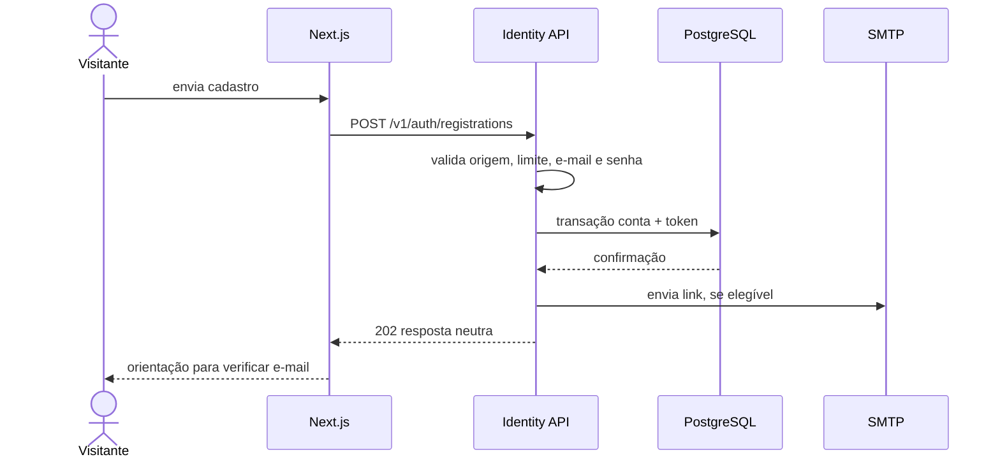
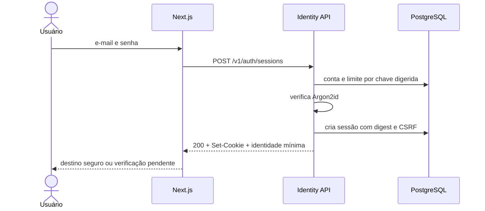
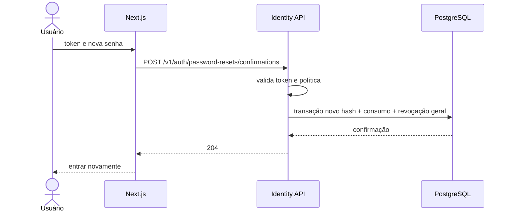

# Plano da Spec 001 — Identidade e Acesso

- **Versão:** 1.0.0
- **Status:** Aprovado
- **Data:** 31 de julho de 2026
- **Spec:** `specs/001-identidade-acesso/spec.md`
- **ADR:** `docs/architecture/ADR-002-autenticacao-e-sessoes.md`

## 1. Resumo técnico

A capacidade será implementada no módulo `identity` do monólito NestJS. O módulo controlará contas, hash de senha, verificação de e-mail, sessões opacas, redefinição e identidade autenticada.

O navegador receberá somente um identificador aleatório em cookie `HttpOnly`. Sessões, autorizações temporárias e limites por conta permanecerão no PostgreSQL por meio do Prisma. O frontend Next.js apresentará os fluxos e consumirá contratos REST; toda decisão de segurança será revalidada no backend.

Não serão adotados JWT, login social, BaaS, Redis, fila ou serviço de identidade externo.

## 2. Verificação constitucional

| Princípio | Atendimento |
|---|---|
| Spec antes do código | Spec 001 está aprovada e possui 18 critérios de aceite |
| Simplicidade do MVP | Uma aplicação backend, PostgreSQL existente e e-mail síncrono com reenvio |
| Monólito modular | Identidade isolada por portas e casos de uso no NestJS |
| Backend como autoridade | Credenciais, sessão, CSRF, estados e permissões são verificados na API |
| Segurança e privacidade | Argon2id, cookie protegido, tokens digeridos, resposta neutra e logs sem segredo |
| Migrations | Quatro estruturas persistentes criadas por Prisma Migrate |
| Contratos explícitos | Endpoints e Problem Details documentados no OpenAPI |
| Testes derivados | Matriz liga cada AC a testes unitários, de integração e E2E |
| Experiência completa | Telas AUT tratam sucesso, campo inválido, expiração, indisponibilidade e abuso |

## 3. Limites dos módulos

### Backend

```text
identity/
├── domain/           # estados, políticas e tipos sem NestJS/Prisma
├── application/      # casos de uso e portas
├── infrastructure/   # Prisma, Argon2id, tokens, sessão e SMTP
└── web/              # controllers, DTOs, guard e identidade da requisição
```

**Responsabilidade do módulo:**

- Criar e localizar conta por e-mail normalizado.
- Proteger e verificar senha.
- Emitir e consumir autorização temporária.
- Criar, resolver e revogar sessão.
- Fornecer identidade atual aos outros módulos.
- Aplicar limitação específica de autenticação.

**Não pertence ao módulo:**

- Edição de perfil profissional.
- Propriedade de oferta ou participação em pedido.
- Suspensão pela interface administrativa.
- Conteúdo institucional.

### Frontend

```text
app/
├── (public)/
├── (auth)/cadastro/
├── (auth)/entrar/
├── (auth)/verificar-email/
├── (auth)/recuperar-senha/
├── (auth)/redefinir-senha/
└── acesso-indisponivel/
```

A estrutura é planejada e poderá receber ajuste mecânico no scaffold do Next.js. Nenhuma página decide autorização de negócio; ela interpreta respostas da API e apresenta o próximo passo.

## 4. Portas da aplicação

| Porta | Responsabilidade | Implementação inicial |
|---|---|---|
| `UserRepository` | Contas e estados | Prisma/PostgreSQL |
| `SessionRepository` | Sessões, atividade e revogação | Prisma/PostgreSQL |
| `AuthTokenRepository` | Verificação e redefinição | Prisma/PostgreSQL |
| `RateLimitRepository` | Contadores e bloqueios temporários | Prisma/PostgreSQL |
| `PasswordHasher` | Hash e verificação | Argon2id |
| `PasswordBlocklist` | Rejeitar senhas comuns/comprometidas | Lista local versionada ou pacote aprovado |
| `SecureTokenGenerator` | Sessão e tokens temporários | CSPRNG do Node.js |
| `TokenDigester` | Digest/HMAC de valores de alta entropia e chaves de limite | Criptografia padrão do Node.js |
| `TransactionalEmailSender` | Enviar verificação, redefinição e aviso | SMTP; Mailpit local |
| `Clock` | Tempo testável | Relógio do sistema em produção, falso em testes |

Portas impedem regras de negócio de depender diretamente de Prisma, SMTP ou detalhes HTTP.

## 5. Casos de uso

| Caso de uso | Entrada principal | Resultado |
|---|---|---|
| `RegisterUser` | Nome, e-mail, senha, confirmações legais | Conta pendente e e-mail solicitado |
| `ConfirmEmailVerification` | Token bruto | E-mail verificado |
| `ResendEmailVerification` | E-mail ou identidade restrita | Resposta neutra e envio elegível |
| `LoginUser` | E-mail e senha | Sessão comum ou restrita |
| `GetCurrentIdentity` | Sessão | Identidade mínima e token CSRF |
| `LogoutSession` | Sessão atual | Sessão revogada |
| `RequestPasswordReset` | E-mail | Resposta neutra e envio elegível |
| `ConfirmPasswordReset` | Token e nova senha | Senha alterada e sessões revogadas |
| `ResolveSession` | Cookie opaco | Identidade válida ou ausência segura |

## 6. Fluxos técnicos

### 6.1 Cadastro



Se SMTP falhar depois do commit, a conta permanece pendente e o usuário pode reenviar. A falha é registrada sem token ou senha. Não será introduzida fila ou outbox no M1.

### 6.2 Login



### 6.3 Redefinição



## 7. Contratos REST

Prefixo da API: `/v1`.

| Operação | Método e caminho | Sessão | CSRF | Sucesso |
|---|---|---:|---:|---|
| Cadastrar | `POST /v1/auth/registrations` | Não | Origem/JSON | `202 Accepted` |
| Confirmar e-mail | `POST /v1/auth/email-verifications/confirmations` | Não | Origem/JSON | `204 No Content` |
| Reenviar verificação | `POST /v1/auth/email-verifications/requests` | Opcional | Origem/JSON | `202 Accepted` |
| Entrar | `POST /v1/auth/sessions` | Não | Origem/JSON | `200 OK` + cookie |
| Consultar sessão | `GET /v1/auth/session` | Sim | Não altera | `200 OK` |
| Sair | `DELETE /v1/auth/session` | Sim | Sim | `204 No Content` |
| Solicitar redefinição | `POST /v1/auth/password-resets/requests` | Não | Origem/JSON | `202 Accepted` |
| Confirmar redefinição | `POST /v1/auth/password-resets/confirmations` | Não | Origem/JSON | `204 No Content` |

Nomes plurais representam criação de solicitações ou recursos temporários sem usar verbos na URL. O OpenAPI explicará o comportamento neutro dos retornos `202`.

### 7.1 Cadastro

```json
{
  "displayName": "Mariana Souza",
  "email": "mariana@example.com",
  "password": "uma frase secreta longa",
  "passwordConfirmation": "uma frase secreta longa",
  "termsVersion": "beta-1",
  "privacyVersion": "beta-1"
}
```

Resposta `202`:

```json
{
  "message": "Se o cadastro puder ser concluído, enviaremos as instruções para o e-mail informado."
}
```

Erros de campo que não dependem da existência da conta usam `422`. E-mail já existente mantém a resposta neutra `202`.

### 7.2 Login

```json
{
  "email": "mariana@example.com",
  "password": "uma frase secreta longa",
  "returnTo": "/ofertas/123/solicitar"
}
```

Resposta `200`:

```json
{
  "user": {
    "id": "uuid",
    "displayName": "Mariana Souza",
    "emailVerified": true,
    "platformRole": "MEMBER"
  },
  "session": {
    "restricted": false,
    "csrfToken": "valor-opaco",
    "returnTo": "/ofertas/123/solicitar"
  }
}
```

Credencial inválida retorna `401` com código genérico `invalid_credentials`. Conta suspensa ou desativada retorna `403` com `account_unavailable`, somente depois de credencial válida.

### 7.3 Sessão atual

`GET /v1/auth/session` retorna a mesma representação mínima do login e um token CSRF associado à sessão. Resposta usa `Cache-Control: no-store`.

Ausência, expiração ou revogação retorna `401` sem distinguir a causa internamente sensível.

### 7.4 Confirmações por token

```json
{
  "token": "valor-recebido-no-link"
}
```

Redefinição acrescenta `password` e `passwordConfirmation`. Token inválido, usado ou expirado retorna `400` com código genérico por finalidade e nunca ecoa o valor recebido.

## 8. Formato de erro

Erros usarão `application/problem+json` conforme RFC 9457:

```json
{
  "type": "https://marketplace.example/problems/validation-error",
  "title": "Não foi possível validar os dados.",
  "status": 422,
  "code": "validation_error",
  "instance": "/problems/trace-id-opaco",
  "errors": [
    {
      "field": "password",
      "code": "password_too_short",
      "message": "Use pelo menos 15 caracteres."
    }
  ]
}
```

### Códigos principais

| HTTP | Código | Uso |
|---:|---|---|
| 400 | `invalid_or_expired_token` | Token não pode ser consumido |
| 400 | `invalid_return_target` | Destino interno inválido, quando precisar ser reportado |
| 401 | `authentication_required` | Sessão ausente ou inválida |
| 401 | `invalid_credentials` | Login genérico inválido |
| 403 | `email_verification_required` | Sessão restrita tentou ação comum |
| 403 | `account_unavailable` | Credencial válida, conta não operacional |
| 403 | `csrf_validation_failed` | Requisição autenticada sem prova CSRF válida |
| 409 | `state_conflict` | Estado concorrente impede consumo seguro |
| 415 | `unsupported_media_type` | Operação JSON recebeu conteúdo simples proibido |
| 422 | `validation_error` | Dados corrigíveis por campo |
| 429 | `rate_limit_exceeded` | Limite temporário; incluir `Retry-After` quando aplicável |

Mensagens públicas não conterão stack trace, nome de tabela, SQL, hash, token ou existência indevida de conta.

## 9. Modelo de dados planejado

### 9.1 `users`

| Campo conceitual | Tipo PostgreSQL planejado | Regra |
|---|---|---|
| `id` | `uuid` | Chave primária gerada |
| `display_name` | `varchar(100)` | Obrigatório após trim e validação |
| `email` | `varchar(320)` | Normalizado, obrigatório e único |
| `password_hash` | `text` | Argon2id, obrigatório |
| `status` | enum | `ACTIVE`, `SUSPENDED`, `DEACTIVATED` |
| `email_verified_at` | `timestamptz` | Nulo até confirmação |
| `platform_role` | enum | `MEMBER` por padrão; `ADMIN` nunca via cadastro público |
| `terms_version` | `varchar(32)` | Versão aceita no cadastro |
| `privacy_version` | `varchar(32)` | Versão reconhecida no cadastro |
| `legal_accepted_at` | `timestamptz` | Evidência temporal |
| `created_at`/`updated_at` | `timestamptz` | Auditoria básica |

Normalização do e-mail será executada por um único objeto de valor antes de busca ou persistência. A política remove espaços externos, converte o endereço completo para minúsculas, limita local/domínio/endereço a 64/255/320 caracteres e valida um formato prático com domínio qualificado. Comparação usa somente o valor normalizado. A constraint única será a defesa final contra cadastros concorrentes.

### 9.2 `sessions`

| Campo | Tipo planejado | Regra |
|---|---|---|
| `id` | `uuid` | Identificador interno não enviado ao navegador |
| `user_id` | `uuid` | FK obrigatória |
| `token_digest` | `char(64)` | SHA-256 em hexadecimal, único |
| `csrf_digest` | `char(64)` | Digest do token vinculado |
| `created_at` | `timestamptz` | Emissão |
| `last_seen_at` | `timestamptz` | Atualização limitada |
| `idle_expires_at` | `timestamptz` | Inatividade |
| `absolute_expires_at` | `timestamptz` | Limite final |
| `revoked_at` | `timestamptz` | Nulo enquanto válida |
| `revoke_reason` | enum nulo | Logout, redefinição, suspensão ou segurança |

Índices: `token_digest` único, `user_id`, expirações e registros ativos necessários à limpeza.

### 9.3 `auth_tokens`

| Campo | Tipo planejado | Regra |
|---|---|---|
| `id` | `uuid` | Chave primária |
| `user_id` | `uuid` | FK obrigatória |
| `purpose` | enum | `EMAIL_VERIFICATION` ou `PASSWORD_RESET` |
| `token_digest` | `char(64)` | Único |
| `created_at`/`expires_at` | `timestamptz` | Janela de uso |
| `consumed_at` | `timestamptz` | Nulo enquanto disponível |
| `invalidated_at` | `timestamptz` | Nova emissão ou ação de segurança |

Emissão invalida tokens pendentes da mesma finalidade e cria o novo dentro de uma transação. Consumo condiciona atualização a token ainda válido, impedindo duas confirmações concorrentes.

### 9.4 `auth_rate_limits`

| Campo | Tipo planejado | Regra |
|---|---|---|
| `action` | enum | Login, cadastro, reenvio, recuperação ou confirmação |
| `key_digest` | `char(64)` | HMAC de chave por conta/origem; não armazena senha |
| `window_started_at` | `timestamptz` | Início da janela |
| `attempt_count` | `integer` | Não negativo |
| `blocked_until` | `timestamptz` | Nulo ou bloqueio temporário |
| `updated_at` | `timestamptz` | Limpeza e diagnóstico |

Chave composta: `action + key_digest`. A implementação deve atualizar contador atomicamente. O segredo HMAC vem de configuração externa.

## 10. Transações e concorrência

### Cadastro

- Criar conta e token de verificação em transação.
- Tratar violação de unicidade como resultado neutro, não como erro interno.
- Enviar e-mail somente após commit.

### Confirmação de e-mail

- Localizar por digest.
- Atualizar `email_verified_at` apenas se token estiver válido e não consumido.
- Consumir/inutilizar tokens pendentes da finalidade na mesma transação.
- Repetição retorna resultado seguro sem nova alteração.

### Login

- Verificar limite e credencial antes de criar sessão.
- Sucesso reinicia ou reduz contador aplicável sem apagar evidência operacional necessária.
- Criação grava digest de sessão e CSRF antes de emitir cookie.

### Redefinição

- Verificar token e política antes da transação.
- Dentro da transação: atualizar hash, consumir token e revogar todas as sessões.
- Falha em qualquer etapa desfaz todas as alterações.

## 11. Configuração inicial

Todos os valores serão validados na inicialização; segredo ausente impedirá a API de iniciar no ambiente correspondente.

| Configuração | Valor inicial |
|---|---|
| `SESSION_ABSOLUTE_TTL` | 7 dias |
| `SESSION_IDLE_TTL` | 24 horas |
| `SESSION_ACTIVITY_TOUCH_INTERVAL` | 15 minutos |
| `EMAIL_VERIFICATION_TTL` | 24 horas |
| `PASSWORD_RESET_TTL` | 30 minutos |
| `EMAIL_RESEND_COOLDOWN` | 60 segundos |
| `EMAIL_RESEND_MAX_PER_DAY` | 5 por conta/origem elegível |
| `PASSWORD_RESET_MAX_PER_HOUR` | 5 por conta e limite complementar por origem |
| `LOGIN_PROGRESSIVE_DELAY_AFTER` | 5 falhas na janela |
| `LOGIN_TEMP_BLOCK_MAX` | 15 minutos, sem bloqueio permanente automático |
| `ARGON2_MEMORY_KIB` | 19456 |
| `ARGON2_ITERATIONS` | 2 |
| `ARGON2_PARALLELISM` | 1 |

Limites serão cobertos por testes com relógio falso. Mudança de produção exigirá registro operacional, não alteração escondida no código.

## 12. E-mail transacional

### Desenvolvimento

- SMTP local capturado pelo Mailpit ou equivalente aprovado.
- Nenhum e-mail real será enviado.
- Links apontarão para a origem local configurada do frontend.

### Beta

- Provedor será escolhido antes da implantação e implementará `TransactionalEmailSender`.
- Credenciais virão do ambiente/gerenciador de segredos.
- Remetente e domínio deverão ser autorizados.

### Templates mínimos

- Verificação de e-mail.
- Redefinição de senha.
- Aviso de senha alterada.

Templates não conterão senha. Links serão construídos a partir de origem confiável configurada, nunca de `Host` não validado da requisição.

## 13. Sessão, CORS e CSRF

- Frontend envia `credentials: include` somente à origem configurada da API.
- API permite origem exata do frontend e nunca usa `*` com credenciais.
- `GET /v1/auth/session` fornece token CSRF ao cliente autenticado.
- Mutação autenticada envia `X-CSRF-Token`.
- Backend compara digest em tempo constante e valida origem.
- Requisição cross-site, origem ausente não permitida ou conteúdo simples inesperado é negado.
- Em desenvolvimento, origens locais são listas explícitas.

O token CSRF permanece apenas em memória de execução do frontend; recarregar a página o obtém novamente pela sessão.

## 14. Estratégia do frontend

### Formulários

- Validação do cliente melhora resposta, mas replica somente regras públicas; backend continua definitivo.
- Campo de senha usa `autocomplete="new-password"` no cadastro e redefinição.
- Login usa identificadores apropriados para gerenciadores de senha.
- Botão não fica permanentemente bloqueado após falha.
- Mensagens usam região anunciável e foco no resumo ou campo inválido.

### Token no link

- Página recebe token da URL e o envia no corpo JSON ao backend.
- Página usa política de referência que não vaza URL para destinos externos.
- Token é removido da URL/histórico visível por substituição assim que capturado, sem persistência local.
- Página de redefinição não carrega recursos de terceiros desnecessários.

### Estado de autenticação

- Um provedor do frontend consulta `/v1/auth/session` e mantém somente identidade mínima e CSRF em memória.
- Middleware do Next.js não considera a presença do cookie prova de autorização.
- Redirecionamento de UX pode ocorrer no frontend; a API continua responsável por negar acesso.

## 15. Observabilidade

### Eventos permitidos

- `identity.registration.requested`.
- `identity.registration.created`.
- `identity.email_verification.completed`.
- `identity.login.succeeded`.
- `identity.login.failed` com motivo interno categorizado.
- `identity.session.revoked`.
- `identity.password_reset.completed`.
- `identity.rate_limit.applied`.

### Dados proibidos

- Senha e confirmação.
- Hash de senha.
- Token bruto ou seu digest completo.
- Cookie ou identificador de sessão.
- Conteúdo integral de cabeçalho de autorização/cookie.

Eventos usarão `traceId`, identificador interno do usuário quando legítimo e códigos categóricos. E-mail só será registrado de forma mascarada ou por digest operacional quando indispensável.

## 16. Limpeza e retenção técnica

- Sessões expiradas e revogadas poderão ser removidas por rotina simples executada fora da requisição crítica.
- Tokens consumidos, invalidados ou expirados serão retidos apenas pelo período operacional definido antes da beta e depois removidos.
- Contadores expirados serão eliminados.
- Não será introduzida fila; uma tarefa agendada simples no monólito ou comando operacional será definida nas tarefas.
- Retenção jurídica de consentimento e conta pertence à política de privacidade e não será apagada por essa limpeza.

## 17. Estratégia de testes

### Unitários

- Normalização de e-mail.
- Política de senha, Unicode, comprimento e blocklist.
- Estados da conta e sessão restrita.
- Validação de destino interno.
- Expiração por relógio falso.
- Limites e atraso progressivo.
- Redação de campos sensíveis em erros/logs.

### Integração com PostgreSQL

- Unicidade concorrente do e-mail.
- Cadastro transacional.
- Emissão, invalidação e consumo único de token.
- Duas confirmações concorrentes: apenas uma produz efeito.
- Criação, resolução, expiração e revogação de sessão.
- Redefinição revoga todas as sessões de forma atômica.
- Contador de limite atualizado atomicamente.

### HTTP

- Status e Problem Details.
- Cookie de produção com `Secure`, `HttpOnly`, `SameSite`, `Path` e sem `Domain`.
- CORS apenas para origem configurada.
- Mutação sem CSRF ou origem válida negada.
- Conteúdo simples indevido negado.
- Cache de respostas de sessão restrito.
- OpenAPI reflete todos os contratos.

### E2E

- Cadastro → e-mail capturado → verificação → login → sessão → logout.
- Cadastro → login restrito → reenvio → verificação.
- Recuperação → e-mail → redefinição → sessões antigas negadas → novo login.
- E-mail inexistente recebe resposta equivalente na recuperação.
- Conta suspensa com senha correta não recebe sessão operacional.
- Usuário A não acessa identidade privada de B.

## 18. Matriz critério × teste

| Critério | Cobertura mínima |
|---|---|
| AC-001-01/02 | Integração de cadastro, unicidade concorrente e E2E de e-mail |
| AC-001-03/04 | Unitários de política e integração de hash sem truncamento |
| AC-001-05/06/07 | Integração de token, relógio e limite; E2E de verificação |
| AC-001-08/09/10/11 | Integração de login/sessão e E2E por estado de conta |
| AC-001-12 | Unitário de `returnTo` e HTTP contra open redirect |
| AC-001-13 | Integração e E2E de revogação |
| AC-001-14 | HTTP/E2E comparando respostas neutras |
| AC-001-15/16 | Integração transacional e E2E de redefinição |
| AC-001-17 | HTTP de autorização cruzada |
| AC-001-18 | Teste de captura/redação e inspeção de respostas |

## 19. Ordem de implementação futura

1. Scaffold mínimo do monorepo e configuração.
2. PostgreSQL local e Prisma.
3. Tipos de domínio, políticas e portas.
4. Migration de identidade.
5. Adaptadores de hash, token, relógio e repositório.
6. Casos de uso de cadastro e verificação.
7. Sessão, guard, CSRF e login/logout.
8. Recuperação e revogação geral.
9. SMTP local e templates.
10. Contratos HTTP e OpenAPI.
11. Telas Next.js.
12. Testes integrados e E2E.
13. Documentação e validação da Definition of Done.

A decomposição exata será registrada em `tasks.md`; esta lista não autoriza código isoladamente.

## 20. Alternativas rejeitadas no plano

| Alternativa | Motivo |
|---|---|
| Redis para sessões/limites | Serviço adicional sem escala demonstrada; PostgreSQL atende ao MVP |
| Fila/outbox para e-mail | Complexidade operacional; reenvio cobre falha inicial da beta |
| Bloqueio permanente após N falhas | Permite negação de serviço contra conta alheia |
| Token na URL da API em `GET` mutável | Vaza com mais facilidade em histórico/log e usa método seguro para mudança |
| Autorização no middleware do Next.js | Presença de cookie não prova validade, estado ou propriedade |
| Regra de composição de senha | Menor benefício que comprimento e blocklist; contraria orientação atual |

## 21. Riscos técnicos

| Risco | Probabilidade | Impacto | Mitigação |
|---|---|---|---|
| Configuração incorreta de cookie/CORS | Média | Alto | Testes HTTP por ambiente e falha na inicialização |
| Vazamento de token em URL/log | Média | Alto | Corpo POST, redaction, referrer restrito e testes |
| Argon2id pesado causa exaustão | Baixa/média | Alto | Limites antes do hash e benchmark dos parâmetros |
| Contador persistente cria contenção | Baixa no MVP | Médio | Atualização atômica, índices e medição |
| SMTP indisponível | Média | Médio | Conta pendente, reenvio e observabilidade |
| Sessões antigas acumulam | Média | Baixo no MVP | Limpeza simples e índices por expiração |
| Lista de senhas desatualizada | Média | Médio | Origem documentada e rotina de atualização controlada |

## 22. Referências técnicas

- [ADR-002 — Autenticação e sessões](../../docs/architecture/ADR-002-autenticacao-e-sessoes.md)
- [RFC 9457 — Problem Details for HTTP APIs](https://www.rfc-editor.org/rfc/rfc9457.html)
- [Prisma — Transactions](https://www.prisma.io/docs/orm/prisma-client/queries/transactions)
- [NestJS — Rate limiting](https://docs.nestjs.com/security/rate-limiting)
- [OWASP Authentication Cheat Sheet](https://cheatsheetseries.owasp.org/cheatsheets/Authentication_Cheat_Sheet.html)
- [OWASP Session Management Cheat Sheet](https://cheatsheetseries.owasp.org/cheatsheets/Session_Management_Cheat_Sheet.html)
- [OWASP CSRF Prevention Cheat Sheet](https://cheatsheetseries.owasp.org/cheatsheets/Cross-Site_Request_Forgery_Prevention_Cheat_Sheet.html)

## 23. Itens que permanecem antes da beta, mas não bloqueiam as tarefas locais

- Escolher provedor SMTP de produção.
- Definir domínios e origens reais.
- Benchmark de Argon2id no ambiente de implantação.
- Definir retenção operacional de sessões e tokens.
- Revisar termos e privacidade com profissional competente.
- Reavaliar MFA para contas administrativas.

## 24. Checklist do plano

- [x] A arquitetura atende à spec sem alterar o comportamento.
- [x] Módulos e dependências estão claros.
- [x] Contratos e erros estão definidos.
- [x] Dados e migrations estão planejados.
- [x] Autorização e privacidade estão cobertas.
- [x] Testes mapeiam critérios e riscos.
- [x] Decisão duradoura possui ADR.
- [x] Não há complexidade futura sem requisito atual.

## 25. Próxima etapa

O plano foi decomposto e está em implementação incremental. As tarefas T-001-001 a T-001-013 estão concluídas; a próxima etapa é T-001-014 — implementação do `UserRepository`.
