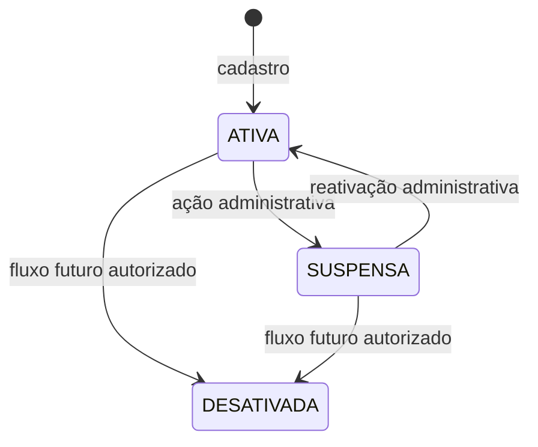
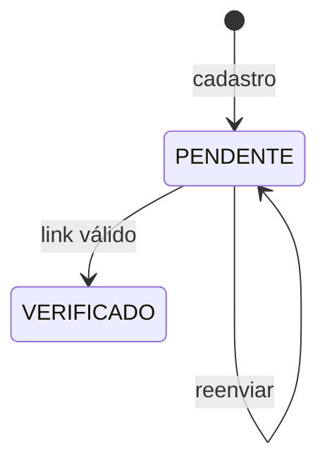

# Spec 001 — Identidade e Acesso

- **Versão:** 1.0.0
- **Status:** Aprovada para planejamento
- **Data:** 31 de julho de 2026
- **Marco:** M1 — Fundação executável
- **Jornadas relacionadas:** J-01, J-02, J-03, J-05 e J-06

## 1. Problema

Visitantes precisam criar uma identidade confiável para executar ações privadas, e usuários precisam retornar à plataforma sem expor suas contas a acesso indevido. Todas as capacidades posteriores dependem de autenticação e autorização consistentes.

Sem essa fundação, perfis, ofertas, pedidos e administração não conseguem determinar com segurança quem age nem quais recursos podem ser acessados.

## 2. Objetivo

Permitir cadastro, verificação de e-mail, login, logout e recuperação de senha com experiência compreensível e proteções proporcionais a uma beta controlada.

Ao final desta capacidade, o sistema deverá reconhecer uma sessão válida, distinguir conta verificada, suspensa ou indisponível e fornecer a identidade autenticada aos módulos de negócio sem expor credenciais.

## 3. Atores

| Ator | Interesse | Permissão relevante |
|---|---|---|
| Visitante | Criar conta ou entrar | Acessar somente operações públicas de identidade |
| Usuário não verificado | Concluir verificação | Entrar em sessão restrita, reenviar verificação e sair |
| Usuário verificado | Usar capacidades privadas | Acessar conforme autorização de cada módulo |
| Usuário suspenso | Entender indisponibilidade | Não iniciar ações protegidas |
| Administrador | Usar área operacional | Autenticar-se como usuário e possuir permissão separada |
| Sistema de e-mail | Entregar links transacionais | Receber somente conteúdo necessário, sem senha |

## 4. Pré-condições

- Páginas públicas e API de identidade estão disponíveis por conexão segura no ambiente de beta.
- Termos de uso e política de privacidade possuem uma versão identificável antes de cadastro real.
- O ambiente possui estratégia de entrega de e-mail adequada: capturador local em desenvolvimento e provedor aprovado antes da beta.
- Nenhuma conta administrativa pode ser criada pelo formulário público.

## 5. Escopo incluído

- Cadastro com nome, e-mail, senha e aceite dos documentos vigentes.
- Política inicial de senha.
- Verificação de e-mail por link de uso único.
- Reenvio controlado da verificação.
- Login por e-mail e senha.
- Sessão web e identificação do usuário autenticado.
- Logout da sessão atual.
- Solicitação de recuperação de senha.
- Redefinição por link de uso único.
- Invalidação de sessões após redefinição.
- Tratamento de conta não verificada, suspensa ou desativada.
- Proteção contra enumeração e tentativas automatizadas.
- Registro técnico e de segurança sem conteúdo secreto.

## 6. Escopo excluído

- Login social.
- Autenticação multifator.
- Passkeys ou autenticação sem senha.
- Alteração de e-mail.
- Troca de senha por usuário já autenticado.
- Exclusão ou anonimização de conta.
- Tela pública de criação de administrador.
- Gestão administrativa de suspensão e reativação, pertencente à Spec 009.
- Organizações, equipes, convites e múltiplas contas por pessoa.
- API pública para integrações de terceiros.

Essas exclusões não autorizam atalhos inseguros. MFA deverá ser reavaliada antes de abertura além da beta controlada, especialmente para administração.

## 7. Requisitos e regras relacionadas

| Referência | Aplicação nesta spec |
|---|---|
| RF-IDA-001 a RF-IDA-007 | Cadastro, verificação, sessão, recuperação, papéis e estados |
| RF-INS-003 | Aceite identificável de termos e privacidade |
| BR-IDA-001 a BR-IDA-014 | Regras transversais de identidade |
| BR-PER-008 | Verificação de e-mail não equivale a identidade verificada |
| BR-ADM-001/002 | Administração exige autenticação e permissão separada |
| BR-SEC-001 a BR-SEC-010 | Validação, privacidade, erros, rastreabilidade e testes |
| BR-UX-001 a BR-UX-006 | Responsividade, estados, erros e acessibilidade |
| RNF-SEC-001 a RNF-SEC-005 | Controles verificáveis de segurança |
| RNF-PRI-001 a RNF-PRI-003 | Coleta mínima e separação de dados |
| RNF-CON-001/002 | Consistência e repetição de operações |
| RNF-UX-001 a RNF-UX-006 | Experiência verificável |
| RNF-API-001/002/005 | Contratos, erros e testes |

## 8. Política de senha

### SPEC-001-R01 — Comprimento

- Senha deve possuir no mínimo 15 caracteres enquanto for o único fator de autenticação.
- Sistema deve aceitar pelo menos 128 caracteres e nunca truncar silenciosamente.

### SPEC-001-R02 — Caracteres

- Espaços e caracteres Unicode devem ser aceitos.
- Não deve haver regra obrigatória de misturar maiúsculas, minúsculas, números ou símbolos.
- Colar senha e usar gerenciador de senhas deve ser permitido.

### SPEC-001-R03 — Senhas inseguras

- Nova senha deve ser comparada com uma lista apropriada de senhas comuns ou comprometidas.
- Senha rejeitada deve receber orientação compreensível sem revelar dados da lista.
- A verificação não pode enviar a senha em texto puro para serviço externo.

### SPEC-001-R04 — Rotação

- Plataforma não exigirá troca periódica arbitrária.
- Redefinição será exigida quando houver evidência de comprometimento ou necessidade operacional de segurança.

### SPEC-001-R05 — Armazenamento

- Senha deve ser protegida por hash adaptativo apropriado e salt único.
- Algoritmo, parâmetros e possível pepper serão definidos no ADR de autenticação.
- Senha, token e hash nunca aparecem em resposta, e-mail ou log.

## 9. Fluxo de cadastro e verificação

### 9.1 Fluxo principal

1. Visitante abre o cadastro.
2. Informa nome, e-mail e senha e confirma a senha.
3. Aceita os termos de uso e reconhece a política de privacidade vigentes.
4. Frontend apresenta requisitos e erros de maneira acessível.
5. Backend normaliza o e-mail, valida todos os campos e aplica proteções contra abuso.
6. Sistema registra conta, hash da senha, versões aceitas e status de verificação pendente como uma operação consistente.
7. Sistema gera autorização de verificação aleatória, com prazo de expiração e de uso único, armazenada de forma segura.
8. Sistema solicita envio de e-mail com link de verificação.
9. Interface apresenta resposta que não confirma indevidamente a existência prévia do e-mail.
10. Usuário abre um link válido.
11. Backend marca o e-mail como verificado e invalida autorizações de verificação pendentes.
12. Usuário é orientado a entrar ou continuar em sua sessão restrita de forma segura.

### 9.2 Conta já existente

- A resposta pública não deve permitir enumeração simples de contas.
- Sistema não cria segunda conta nem altera a senha existente.
- Quando seguro e operacionalmente viável, a conta existente pode receber aviso de tentativa de cadastro, sem incluir senha informada.

### 9.3 Link inválido, expirado ou usado

- Sistema não altera a conta.
- Interface informa que o link não pode mais ser usado e oferece reenvio quando permitido.
- Resposta não exibe o token nem detalhes internos.

### 9.4 Reenvio

- Usuário informa o e-mail ou usa sessão restrita.
- Resposta é neutra quanto à existência da conta.
- Nova autorização invalida a anterior quando emitida.
- Reenvios repetidos recebem limitação proporcional sem bloquear permanentemente a conta.

## 10. Fluxo de login e sessão

### 10.1 Fluxo principal

1. Visitante informa e-mail e senha.
2. Backend normaliza o e-mail, aplica proteção contra abuso e verifica credenciais de forma segura.
3. Se conta e credencial forem válidas e permitidas, o backend inicia uma sessão web.
4. Frontend recebe apenas os dados necessários da identidade atual.
5. Usuário verificado retorna ao destino privado pretendido quando ele for seguro e autorizado.

### 10.2 E-mail não verificado

- Credenciais corretas podem iniciar uma sessão restrita.
- Usuário é direcionado à verificação e pode reenviar o e-mail ou sair.
- Usuário não verificado não pode criar oferta, solicitar pedido ou executar ação administrativa.
- Páginas públicas permanecem acessíveis.

### 10.3 Credencial inválida

- Resposta usa mensagem genérica que não distingue e-mail inexistente de senha incorreta.
- Nenhuma sessão é criada.
- Tentativa relevante alimenta proteção contra abuso e observabilidade sem registrar a senha.

### 10.4 Conta suspensa ou desativada

- Mesmo com credencial correta, nenhuma sessão operacional comum é concedida.
- Interface informa indisponibilidade de forma compreensível, sem revelar detalhes administrativos indevidos.
- Fluxo de recuperação de senha não reativa a conta.

### 10.5 Retorno seguro

- Destino solicitado antes do login deve ser interno e validado.
- Sistema não redireciona para endereço externo fornecido pelo usuário.
- Se o destino não for permitido, usuário segue para uma página autenticada segura.

## 11. Logout

1. Usuário autenticado solicita saída.
2. Backend invalida a sessão atual.
3. Identificador no navegador deixa de autorizar operações.
4. Interface retorna a uma página pública e confirma a saída.
5. Repetir logout não cria erro prejudicial nem reativa sessão.

## 12. Recuperação e redefinição de senha

### 12.1 Solicitação

1. Visitante informa e-mail.
2. Backend aplica limitação de tentativas.
3. Interface sempre apresenta resposta consistente, exista ou não a conta.
4. Se houver conta elegível, sistema cria autorização aleatória, com prazo de expiração e de uso único.
5. Sistema envia link por e-mail sem incluir senha ou informação sensível desnecessária.
6. Solicitar recuperação não suspende nem altera imediatamente a conta.

### 12.2 Redefinição

1. Usuário abre link válido.
2. Informa e confirma nova senha segundo a política vigente.
3. Backend valida autorização e senha antes de qualquer mudança.
4. Sistema atualiza o hash e consome a autorização em uma operação consistente.
5. Todas as sessões existentes da conta são invalidadas.
6. Sistema envia aviso de senha alterada, sem incluir a senha.
7. Usuário não é autenticado automaticamente; é direcionado ao login comum.

### 12.3 Falhas

- Token inválido, expirado ou já usado não altera senha.
- Repetição da mesma confirmação não aplica novamente o efeito.
- Conta suspensa pode redefinir a senha, mas permanece impedida de usar capacidades protegidas.
- Perguntas de segurança não são usadas.

## 13. Estados conceituais

### Conta

### Verificação de e-mail

O estado da conta e a verificação são dimensões separadas. Uma conta ativa ainda não verificada possui sessão restrita.

## 14. Dados envolvidos

| Informação | Origem | Visibilidade | Obrigatória | Finalidade |
|---|---|---|---:|---|
| Nome | Visitante | Perfil conforme regra futura | Sim | Identificação e perfil básico |
| E-mail normalizado | Visitante/backend | Privada | Sim | Login e mensagens transacionais |
| Senha | Visitante | Nunca persistida em claro | Sim | Verificação momentânea da credencial |
| Hash de senha | Backend | Interna e altamente restrita | Sim | Autenticação |
| Estado da conta | Sistema/admin | Próprio usuário e módulos autorizados | Sim | Autorizar operações |
| Data de verificação | Sistema | Privada | Após verificação | Comprovar controle do e-mail |
| Versões legais aceitas | Visitante/sistema | Privada e administrativa autorizada | Sim | Evidência de aceite na beta |
| Sessão | Backend/navegador | Restrita | Durante acesso | Manter autenticação web |
| Autorização de verificação | Backend | Secreta | Temporária | Confirmar e-mail |
| Autorização de redefinição | Backend | Secreta | Temporária | Permitir nova senha |
| Eventos de segurança | Backend | Operacional restrita | Conforme risco | Diagnóstico e detecção de abuso |

## 15. Permissões

| Operação | Visitante | Sessão não verificada | Usuário verificado | Suspenso/desativado | Administrador |
|---|---:|---:|---:|---:|---:|
| Cadastrar | Sim | Não necessário | Não necessário | Não reativa | Não especial |
| Verificar e-mail por token | Sim | Sim | Idempotente | Não reativa | Não especial |
| Reenviar verificação | Sim, resposta neutra | Sim | Sem efeito sensível | Limitado | Não especial |
| Login | Sim | — | Sim | Negado operacionalmente | Sim, com permissão separada |
| Logout | Sem efeito | Sim | Sim | Se houver sessão limitada | Sim |
| Solicitar recuperação | Sim | Sim | Sim | Pode receber sem reativar | Sim |
| Redefinir por token | Sim | Sim | Sim | Não reativa | Sim |
| Ação privada de marketplace | Não | Não | Conforme módulo | Não | Conforme módulo e permissão |

## 16. Estados de interface

### Cadastro

- Inicial.
- Campos inválidos.
- Envio em andamento.
- Resposta neutra e orientação para e-mail.
- Falha recuperável sem perda indevida do nome e e-mail.
- Limitação temporária por abuso.

### Verificação

- Aguardando ação.
- Confirmando.
- Verificada.
- Link inválido, expirado ou usado.
- Reenvio disponível, em espera ou limitado.

### Login

- Inicial.
- Credenciais inválidas com mensagem genérica.
- Sessão iniciada.
- Verificação pendente.
- Conta indisponível.
- Destino não autorizado.

### Recuperação

- Solicitação inicial e confirmação neutra.
- Token válido com formulário.
- Token inválido ou expirado.
- Nova senha inválida ou comprometida.
- Redefinição concluída com retorno ao login.

Todos os formulários devem permitir teclado, gerenciador de senhas, foco previsível e mensagens associadas aos campos.

## 17. Critérios de aceite

### AC-001-01 — Cadastro válido

- **Dado que** um visitante informa dados válidos e aceita os documentos vigentes.
- **Quando** confirma o cadastro.
- **Então** uma única conta é registrada com senha protegida e verificação pendente.
- **E** uma solicitação de e-mail de verificação é produzida sem expor o token em logs.

### AC-001-02 — E-mail duplicado

- **Dado que** o e-mail normalizado já pertence a uma conta.
- **Quando** alguém tenta cadastrar novamente.
- **Então** nenhuma segunda conta é criada e nenhuma senha é alterada.
- **E** a resposta pública não permite confirmar facilmente a existência da conta.

### AC-001-03 — Política de senha

- **Dado que** uma nova senha possui menos de 15 caracteres ou consta na lista de senhas bloqueadas.
- **Quando** é enviada no cadastro ou redefinição.
- **Então** é rejeitada com orientação de correção.
- **E** não é armazenada nem enviada em claro a serviço externo.

### AC-001-04 — Senha longa e acessível

- **Dado que** a senha válida possui espaços, Unicode ou foi colada de um gerenciador.
- **Quando** respeita o limite aceito.
- **Então** é processada integralmente sem truncamento ou regra de composição arbitrária.

### AC-001-05 — Verificação válida

- **Dado que** existe autorização de verificação válida e não usada.
- **Quando** o usuário abre o link.
- **Então** o e-mail é marcado como verificado uma única vez e o usuário recebe confirmação.

### AC-001-06 — Verificação inválida

- **Dado que** o link expirou, foi usado ou é inválido.
- **Quando** alguém tenta confirmá-lo.
- **Então** nenhum estado sensível é alterado e a interface oferece caminho seguro para reenvio.

### AC-001-07 — Reenvio controlado

- **Dado que** alguém solicita repetidamente e-mail de verificação.
- **Quando** ultrapassa os limites definidos no plano.
- **Então** o sistema reduz ou bloqueia temporariamente novos envios sem revelar a existência da conta.

### AC-001-08 — Login verificado

- **Dado que** a conta está ativa, verificada e a senha está correta.
- **Quando** o usuário entra.
- **Então** uma sessão segura é criada e a identidade mínima fica disponível aos módulos autorizados.

### AC-001-09 — Login não verificado

- **Dado que** a conta está ativa, não verificada e a senha está correta.
- **Quando** o usuário entra.
- **Então** recebe sessão restrita e é direcionado à verificação.
- **E** ações privadas do marketplace são negadas.

### AC-001-10 — Credencial inválida

- **Dado que** e-mail ou senha não correspondem a uma conta utilizável.
- **Quando** o login é tentado.
- **Então** nenhuma sessão é criada e a mensagem não distingue qual dado falhou.

### AC-001-11 — Conta suspensa

- **Dado que** a conta está suspensa.
- **Quando** as credenciais corretas são apresentadas.
- **Então** nenhuma sessão operacional é concedida e nenhuma capacidade de negócio é liberada.

### AC-001-12 — Destino seguro

- **Dado que** o login recebeu um destino externo ou não autorizado.
- **Quando** a autenticação termina.
- **Então** o sistema ignora esse destino e usa uma página interna segura.

### AC-001-13 — Logout

- **Dado que** existe sessão válida.
- **Quando** o usuário sai.
- **Então** a sessão é invalidada e não autoriza nova operação protegida.

### AC-001-14 — Recuperação neutra

- **Dado que** qualquer e-mail é informado na recuperação.
- **Quando** a solicitação é enviada.
- **Então** a resposta pública é consistente para conta existente ou inexistente.
- **E** somente conta elegível gera autorização e e-mail.

### AC-001-15 — Redefinição válida

- **Dado que** a autorização é válida, não usada e a nova senha atende à política.
- **Quando** a redefinição é confirmada.
- **Então** o hash é atualizado, a autorização é consumida e sessões existentes são invalidadas.
- **E** o usuário retorna ao login sem autenticação automática.

### AC-001-16 — Redefinição repetida ou inválida

- **Dado que** a autorização é inválida, expirada ou já usada.
- **Quando** a redefinição é tentada.
- **Então** a senha permanece inalterada e nenhuma sessão é criada.

### AC-001-17 — Acesso a recurso de terceiro

- **Dado que** uma sessão pertence a outro usuário ou não possui permissão.
- **Quando** tenta acessar identidade ou operação protegida alheia.
- **Então** a operação é negada sem retornar dados privados.

### AC-001-18 — Segredos ausentes da observabilidade

- **Dado que** cadastro, login, verificação, recuperação e logout são executados em sucesso e falha.
- **Quando** logs e respostas são inspecionados.
- **Então** não contêm senha, hash, token completo, cookie de sessão ou segredo.

## 18. Eventos e evidências da beta

Sem registrar conteúdo secreto, o sistema deverá permitir medir:

- Cadastro solicitado e concluído.
- Verificação concluída e reenvios limitados.
- Login bem-sucedido e falha agregada para operação.
- Recuperação solicitada e redefinição concluída.
- Sessões invalidadas por logout ou redefinição.
- Abandono entre cadastro e verificação.

Métricas de segurança não devem ser públicas nem conter e-mail em texto aberto quando um identificador técnico for suficiente.

## 19. Riscos e abusos

| Risco | Impacto | Tratamento obrigatório |
|---|---|---|
| Enumeração de contas | Privacidade e ataques direcionados | Respostas genéricas e consistentes |
| Credential stuffing | Tomada de conta | Limitação progressiva, senha bloqueada e monitoramento |
| Força bruta distribuída | Tomada de conta | Controles por conta e sinais complementares, sem depender só de IP |
| Bloqueio malicioso de terceiros | Negação de serviço | Evitar bloqueio permanente simples por tentativas públicas |
| Roubo de token por log | Tomada de conta | Token não registrado e armazenado de forma segura |
| Reuso de token | Tomada de conta | Uso único, expiração e consumo atômico |
| Open redirect | Phishing | Destino interno validado |
| Fixação ou roubo de sessão | Tomada de conta | Estratégia segura definida no ADR |
| Senha comprometida | Tomada de conta | Lista de bloqueio sem envio da senha em claro |
| Conta administrativa sem MFA | Impacto elevado | Beta restrita, permissão mínima e reavaliação obrigatória antes de expansão |

## 20. Dependências

- Constituição SDD.
- ADR-001 — Stack inicial.
- Termos de uso e política de privacidade antes do cadastro de usuários reais.
- Capturador local de e-mail para desenvolvimento.
- Provedor de e-mail aprovado antes da beta.

## 21. Decisões destinadas ao plano e ao ADR

Estas questões não alteram o comportamento aprovado, mas devem ser resolvidas antes das tarefas:

- Sessão de servidor ou estratégia de tokens adequada à aplicação web.
- Configuração segura de cookies, expiração e rotação.
- Algoritmo e parâmetros de hash.
- Armazenamento seguro dos tokens de verificação e redefinição.
- Limites, janelas e resposta progressiva contra abuso.
- Duração configurável de sessão e autorizações temporárias.
- Capturador de e-mail local e abstração para provedor futuro.
- Formato padronizado de erro da API.

## 22. Referências de segurança

- [NIST SP 800-63B — Authentication and Authenticator Management](https://pages.nist.gov/800-63-4/sp800-63b.html)
- [OWASP Authentication Cheat Sheet](https://cheatsheetseries.owasp.org/cheatsheets/Authentication_Cheat_Sheet.html)
- [OWASP Password Storage Cheat Sheet](https://cheatsheetseries.owasp.org/cheatsheets/Password_Storage_Cheat_Sheet.html)
- [OWASP Forgot Password Cheat Sheet](https://cheatsheetseries.owasp.org/cheatsheets/Forgot_Password_Cheat_Sheet.html)

As referências orientam controles técnicos; a Constituição e esta spec permanecem as autoridades de comportamento do projeto.

## 23. Checklist de aprovação

- [x] Problema e objetivo estão claros.
- [x] Atores e permissões estão identificados.
- [x] Escopo incluído e excluído estão explícitos.
- [x] Requisitos e regras possuem referências.
- [x] Fluxos de sucesso, falha e abuso estão cobertos.
- [x] Dados e visibilidade estão definidos conceitualmente.
- [x] Critérios de aceite são verificáveis.
- [x] Questões comportamentais bloqueantes foram resolvidas.
- [x] Decisões técnicas foram reservadas ao plano e ao ADR.

## 24. Próxima etapa

Produzir o plano técnico da Spec 001 e o ADR de autenticação. Nenhum código de identidade está autorizado antes da aprovação desses artefatos e da lista de tarefas.
