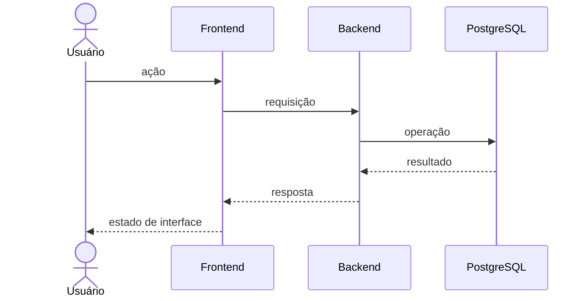

# Plano da Spec [NNN] — [Nome da capacidade]

- **Versão:** 0.1.0
- **Status:** Proposta
- **Spec:** `specs/[pasta]/spec.md`
- **Data:** [data]

## 1. Resumo técnico

[Explicar como a arquitetura existente atenderá à spec.]

## 2. Verificação constitucional

| Princípio | Como será atendido |
|---|---|
| Spec antes do código | [evidência] |
| Simplicidade do MVP | [evidência] |
| Monólito modular | [limites] |
| Backend como autoridade | [validações] |
| Segurança e privacidade | [controles] |
| Migrations | [estratégia] |
| Contratos explícitos | [OpenAPI] |
| Testes derivados | [mapeamento] |

## 3. Contextos e módulos afetados

| Aplicação | Módulo | Responsabilidade | Dependências |
|---|---|---|---|
| Backend | [módulo] | [responsabilidade] | [dependências] |
| Frontend | [área] | [responsabilidade] | [contrato] |

## 4. Fluxo técnico

## 5. Contratos de API

| Operação | Método e caminho | Autorização | Entrada | Saída | Erros principais |
|---|---|---|---|---|---|
| [operação] | `[METHOD] /path` | [regra] | [DTO] | [resposta] | [códigos] |

Detalhar formatos sem divergir dos critérios de aceite.

## 6. Modelo de dados

### Entidades afetadas

| Conceito | Dados necessários | Restrições | Observação de migration |
|---|---|---|---|
| [conceito] | [dados] | [unicidade/relação] | [criar/alterar] |

### Consistência e transações

- [Operações que precisam ser atômicas.]
- [Concorrência ou idempotência necessária.]

## 7. Autenticação e autorização

- [Como a identidade é obtida.]
- [Como propriedade ou participação é verificada.]
- [Cenários de acesso negado.]

## 8. Validação e erros

| Entrada/condição | Validação | Erro público | Registro interno |
|---|---|---|---|
| [caso] | [regra] | [formato] | [necessidade] |

## 9. Segurança e privacidade

- Dados coletados e finalidade.
- Dados retornados por ator.
- Proteção contra abuso.
- Segredos e configurações.
- Retenção ou histórico relevante.

## 10. Estratégia de interface

| Tela | Dados | Ações | Estados especiais |
|---|---|---|---|
| [ID da tela] | [dados] | [ações] | [vazio/erro/permissão] |

## 11. Observabilidade

- Logs técnicos necessários.
- Eventos de negócio relevantes.
- Informações proibidas em logs.
- Sinais de falha ou abuso.

## 12. Estratégia de testes

| Critério/regra | Nível | Cenário | Evidência |
|---|---|---|---|
| [AC/BR] | Unitário/integração/E2E | [cenário] | [asserção] |

Cobrir sucesso, validação, acesso negado, estado inválido e repetição quando aplicável.

## 13. Migração e compatibilidade

- Ordem de migration e implantação.
- Compatibilidade com dados ou contratos existentes.
- Recuperação em caso de falha.

## 14. Alternativas consideradas

| Alternativa | Benefício | Custo/risco | Decisão |
|---|---|---|---|
| [alternativa] | [benefício] | [custo] | [aceita/rejeitada] |

## 15. ADRs necessários

- [ADR novo ou “nenhum”.]

## 16. Riscos técnicos

| Risco | Probabilidade | Impacto | Mitigação |
|---|---|---|---|
| [risco] | [baixa/média/alta] | [impacto] | [mitigação] |

## 17. Checklist do plano

- [ ] A arquitetura atende à spec sem alterar o comportamento.
- [ ] Módulos e dependências estão claros.
- [ ] Contratos e erros estão definidos.
- [ ] Dados e migrations estão planejados.
- [ ] Autorização e privacidade estão cobertas.
- [ ] Testes mapeiam critérios e riscos.
- [ ] Decisões duradouras possuem ADR.
- [ ] Não há complexidade futura sem requisito atual.
